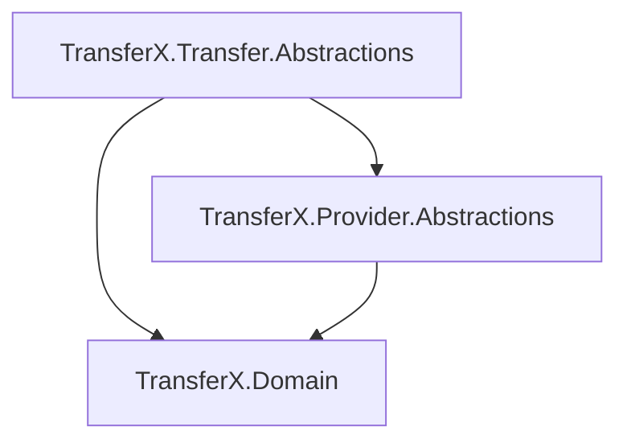
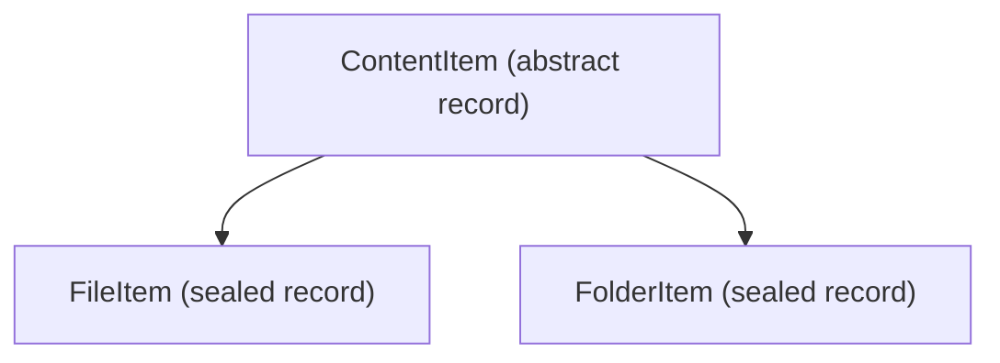
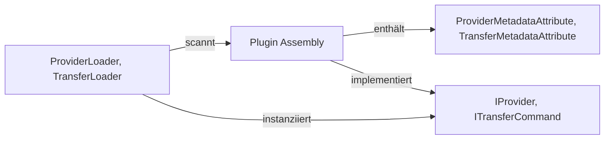

<!-- Migriert aus TransferX\Source\TransferX\docs, Stand: 2026-06-26 -->

# Projekt: TransferX Abstractions

Basis Dokumente: [README](../../README.md), [Coding Standards](../conventions/coding-standards.md) und [TransferX Architektur](../architecture/architecture.md)

Rolle in der Architektur: **Abstractions Layer** definiert die Plugin Schnittstellen für Provider- und Transfer-Handler. Plugins implementieren diese Interfaces. Der Core Layer nutzt die Abstractions zum dynamischen Laden der Plugins.


## Projektübersicht

| Namespace, Projekt                | Beschreibung                                                 |
| --------------------------------- | ------------------------------------------------------------ |
| `TransferX.Provider.Abstractions` | Plugin Schnittstellen für Provider (WebDAV, FTP, IMAP usw.)  |
| `TransferX.Transfer.Abstractions` | Plugin Schnittstellen für Transfer Commands (ITransferCommand, je Plugin genau ein Command) |

### Abhängigkeiten




## Projektstrukturen

### TransferX.Provider.Abstractions

```tex
TransferX.Provider.Abstractions
|   IProvider.cs
|   IProviderCommand.cs
|   IProviderQuery.cs
|   TransferX.Provider.Abstractions.csproj
|
+---Contracts
|       ProviderRequest.cs
|       ProviderResponse.cs
|       ProviderResult.cs
|
+---Metadata
|       ProviderMetadataAttribute.cs
|
+---Models
|       ContentItem.cs
|       FileItem.cs
|       FolderItem.cs
|       ProviderConfigItem.cs
|       ProviderCredentials.cs
|       StorageItem.cs
|
+---Requests
|       CreateFolderRequest.cs
|       DeleteFileRequest.cs
|       DownloadFileRequest.cs
|       ListFilesRequest.cs
|       ListFoldersRequest.cs
|       UploadFileRequest.cs
|
\---Responses
        CreateFolderResponse.cs
        DeleteFileResponse.cs
        DownloadFileResponse.cs
        ListFilesResponse.cs
        ListFoldersResponse.cs
        UploadFileResponse.cs
```

### TransferX.Transfer.Abstractions

```tex
TransferX.Transfer.Abstractions
|   ITransferCommand.cs
|   TransferX.Transfer.Abstractions.csproj
|
+---Metadata
|       TransferMetadataAttribute.cs
|
\---Models
        ChangeItem.cs
        FileTransferResult.cs
        TransferConfigItem.cs
        TransferResult.cs
```


## TransferX.Provider.Abstractions

### Interfaces

#### `IProvider`

Haupt-Interface für alle Provider-Plugins. Wird vom `ProviderLoader` dynamisch geladen und vom `ProviderEngine` orchestriert.

| Member                                                                              | Beschreibung                                                              |
| ----------------------------------------------------------------------------------- | ------------------------------------------------------------------------- |
| `string Name`                                                                       | Anzeigename des Providers                                                 |
| `string Version`                                                                    | Versionsnummer des Providers                                              |
| `string ProviderType`                                                               | Technischer Typ (z.B. `"WebDav"`, `"Ftp"`)                                |
| `Task InitializeAsync(ProviderConfigItem, CancellationToken)`                       | Initialisiert den Provider vor der ersten Operation                        |
| `Task<ProviderResponse> ExecuteAsync(ProviderRequest, IProgress<FileProgress>?, CancellationToken)` | Führt eine Provider-Operation (Command oder Query) aus |

> **Instanziierung:** Der `ProviderLoader` erzeugt Provider per Reflection mit `Activator.CreateInstance(Type)`.
> Dafür ist ein **explizit parameterloser Konstruktor** erforderlich. Primary Constructors mit optionalen
> Parametern (z.B. `MyProvider(ILoggerFactory? loggerFactory = null)`) genügen **nicht** – Reflection wendet
> optionale C#-Defaultwerte nicht an. `new MyProvider()` kompiliert zwar, der Host schlägt jedoch mit
> `MissingMethodException` fehl. Konfiguration erfolgt über `InitializeAsync`, nicht über den Konstruktor.

#### `IProviderCommand<TRequest, TResponse>`

Definiert einen Provider-Befehl (Command) nach dem **CQS-Muster**. Commands ändern den Zustand beim Provider (z.B. Upload, Ordner erstellen, Löschen).

| Member                                                                                    | Beschreibung                                |
| ----------------------------------------------------------------------------------------- | ------------------------------------------- |
| `Task<TResponse> ExecuteAsync(TRequest, IProgress<FileProgress>?, CancellationToken)`    | Führt den Befehl asynchron aus              |

> **Constraints:** `TRequest : ProviderRequest`, `TResponse : ProviderResponse`

#### `IProviderQuery<TRequest, TResponse>`

Definiert eine Provider-Abfrage (Query) nach dem **CQS-Muster**. Queries lesen Daten ohne Zustandsänderung (z.B. Listing, Download).

| Member                                                                                    | Beschreibung                                |
| ----------------------------------------------------------------------------------------- | ------------------------------------------- |
| `Task<TResponse> ExecuteAsync(TRequest, IProgress<FileProgress>?, CancellationToken)`    | Führt die Abfrage asynchron aus             |

> **Constraints:** `TRequest : ProviderRequest`, `TResponse : ProviderResponse`

---

### Contracts

#### `ProviderRequest`

Abstrakte Marker-Basisklasse (`abstract record`) für alle Provider-Anfragen. Wird als generischer Typconstraint eingesetzt.

#### `ProviderResponse`

Abstrakte Marker-Basisklasse (`abstract record`) für alle Provider-Antworten. Ermöglicht polymorphen Rückgabetyp in `IProvider.ExecuteAsync`.

#### `ProviderResult`

Kapselt das Ergebnis einer Provider-Operation mit Erfolgs- und Fehlerstatus. Factory-Methoden für einfache Erstellung:

| Methode                                           | Beschreibung                                       |
| ------------------------------------------------- | -------------------------------------------------- |
| `static ProviderResult Ok()`                      | Erstellt ein erfolgreiches Ergebnis                |
| `static ProviderResult Fail(string)`              | Erstellt ein fehlerhaftes Ergebnis mit Nachricht   |
| `static ProviderResult Fail(string, Exception)`   | Erstellt ein fehlerhaftes Ergebnis mit Ausnahme    |

| Property          | Typ          | Beschreibung                               |
| ----------------- | ------------ | ------------------------------------------ |
| `Success`         | `bool`       | Gibt an, ob die Operation erfolgreich war  |
| `ErrorMessage`    | `string?`    | Fehlermeldung im Fehlerfall, sonst `null`  |
| `Exception`       | `Exception?` | Optionale zugrundeliegende Ausnahme        |

---

### Metadata

#### `ProviderMetadataAttribute`

Marker-Attribut zur Plugin-Discovery von Provider-Implementierungen. Wird vom `ProviderLoader` zur Plugin-Discovery verwendet.
Metadaten wie Name, Version und ProviderType werden nach der Instanziierung direkt über das `IProvider`-Interface gelesen.

```
[ProviderMetadata]
public class WebDavProvider : IProvider
{
    public string Name => "WebDav Provider";
    public string Version => "1.0.0";
    public string ProviderType => "WebDav";
    // ...
}
```

> **Verwendung:** `[AttributeUsage(AttributeTargets.Class, AllowMultiple = false, Inherited = false)]`

> **Instanziierung:** Zusätzlich zum Attribut muss die Provider-Klasse einen parameterlosen Konstruktor
> besitzen. Details und Beispiele siehe [Provider Plugin implementieren](../providers/implement-provider-plugin.md#8-plugin-discovery-durch-den-providerloader).


### Models

#### Vererbungshierarchie



#### `ContentItem`

Abstrakte Basisklasse für Einträge im Provider-Dateisystem. Gemeinsame Basis für `FileItem` und `FolderItem`.

| Property       | Typ        | Beschreibung                              |
| -------------- | ---------- | ----------------------------------------- |
| `Name`         | `string`   | Name des Eintrags (ohne Pfad)             |
| `Path`         | `string`   | Vollständiger Pfad beim Provider          |
| `LastModified` | `DateTime` | Zeitpunkt der letzten Änderung (UTC)      |

#### `FileItem`

Repräsentiert eine Datei im Provider-Dateisystem. Erbt von `ContentItem`.

| Property      | Typ       | Beschreibung                          |
| ------------- | --------- | ------------------------------------- |
| `Size`        | `long`    | Dateigrösse in Bytes                  |
| `ContentType` | `string?` | MIME-Typ der Datei, `null` wenn unbekannt |

#### `FolderItem`

Repräsentiert einen Ordner im Provider-Dateisystem. Erbt von `ContentItem`.

| Property      | Typ    | Beschreibung                               |
| ------------- | ------ | ------------------------------------------ |
| `HasChildren` | `bool` | Gibt an, ob der Ordner Unterordner enthält |

#### `StorageItem`

Repräsentiert Speicherinformationen eines Providers.

| Property     | Typ    | Beschreibung                                        |
| ------------ | ------ | --------------------------------------------------- |
| `TotalBytes` | `long` | Gesamtkapazität in Bytes                            |
| `FreeBytes`  | `long` | Freier Speicher in Bytes                            |
| `UsedBytes`  | `long` | Verwendeter Speicher (berechnet: `Total - Free`)    |

#### `ProviderConfigItem`

Konfigurationsdaten eines Provider-Plugins. Wird beim Initialisieren via `IProvider.InitializeAsync` übergeben.

| Property       | Typ                   | Beschreibung                                        |
| -------------- | --------------------- | --------------------------------------------------- |
| `Id`           | `Guid`                | Eindeutige ID der Provider-Konfiguration            |
| `Name`         | `string`              | Anzeigename des Providers                           |
| `ProviderType` | `string`              | Technischer Typ (z.B. `"WebDav"`, `"Ftp"`)         |
| `BasePath`     | `string`              | Basis-URL oder Pfad des Providers                   |
| `Credentials`  | `ProviderCredentials?`| Zugangsdaten, `null` wenn keine Authentifizierung   |

#### `ProviderCredentials`

Zugangsdaten für einen Provider. Das Passwort wird in `ToString()` maskiert ausgegeben (`Username:***`).

| Property   | Typ      | Beschreibung                          |
| ---------- | -------- | ------------------------------------- |
| `Username` | `string` | Benutzername für die Authentifizierung |
| `Password` | `string` | Passwort für die Authentifizierung    |

---

### Requests & Responses

Alle Request-Klassen erben von `ProviderRequest`, alle Response-Klassen von `ProviderResponse`.

| Request                  | Response                  | Operation                              | Key Properties                                              |
| ------------------------ | ------------------------- | -------------------------------------- | ----------------------------------------------------------- |
| `ListFoldersRequest`     | `ListFoldersResponse`     | Ordner unterhalb eines Pfades auflisten | `Path` → `IReadOnlyList<FolderItem> Items`                 |
| `ListFilesRequest`       | `ListFilesResponse`       | Dateien unterhalb eines Pfades auflisten | `Path` → `IReadOnlyList<FileItem> Items`                  |
| `DownloadFileRequest`    | `DownloadFileResponse`    | Datei herunterladen                    | `Path` → `Stream Stream`, `long FileSize`                  |
| `UploadFileRequest`      | `UploadFileResponse`      | Datei hochladen                        | `TargetPath`, `Func<CancellationToken, Task<Stream>> ContentFactory`, `FileSize` → `bool Success`, `long BytesTransferred` |
| `CreateFolderRequest`    | `CreateFolderResponse`    | Ordner erstellen                       | `Path` → `bool Success`, `string Path`                     |
| `DeleteFileRequest`      | `DeleteFileResponse`      | Datei löschen                          | `Path` → `bool Success`                                    |

> **Hinweis `UploadFileRequest.ContentFactory`:** Der Stream wird über eine Factory-Funktion bereitgestellt, damit Retry-Szenarien den Stream neu erzeugen können.


## TransferX.Transfer.Abstractions

### Interface

#### `ITransferCommand`

Haupt-Interface für alle Transfer-Command-Plugins. Wird vom `TransferLoader` dynamisch geladen und vom `TransferEngine` orchestriert. Jedes Plugin implementiert genau einen Transfer-Command.

| Member                                                       | Beschreibung                                   |
| ------------------------------------------------------------ | ---------------------------------------------- |
| `string CommandName`                                         | Eindeutiger Command-Name (z.B. "Copy", "Sync") |
| `string Description`                                         | Beschreibung des Commands                      |
| `string Version`                                             | Versionsnummer des Commands                    |
| `Task<TransferResult> ExecuteAsync(TransferConfigItem, IProvider, IProvider, IProgress<ProgressReport>?, CancellationToken)` | Führt den Transfer-Command asynchron aus       |

### Metadata

#### `TransferMetadataAttribute`

Marker-Attribut zur Plugin-Discovery von Transfer-Command-Implementierungen. Wird vom `TransferLoader` zur Plugin-Discovery verwendet.
Metadaten (CommandName, Description, Version) werden nach der Instanziierung direkt über das `ITransferCommand`-Interface gelesen. 
Pro Assembly wird genau ein Transfer-Command erwartet.

```c#
[TransferMetadata]
public class CopyCommand : ITransferCommand
{
    public string CommandName => "Copy";
    public string Description => "Kopiert alle Dateien vom Quell- zum Zielpfad.";
    public string Version => "1.0.0";  // or get Transfer plugin assembly version
    // ...
}
```


### Models

#### `TransferConfigItem`

Konfigurationsdaten für einen Transfer-Auftrag. Wird beim Start eines Transfers an `ITransferHandler.ExecuteAsync` übergeben.

| Property           | Typ                 | Beschreibung                              |
| ------------------ | ------------------- | ----------------------------------------- |
| `TransferId`       | `Guid`              | Eindeutige ID des Transfer-Auftrags       |
| `SourceProviderId` | `Guid`              | ID des Quell-Providers                    |
| `SourcePath`       | `string`            | Quellpfad beim Quell-Provider             |
| `TargetProviderId` | `Guid`              | ID des Ziel-Providers                     |
| `TargetPath`       | `string`            | Zielpfad beim Ziel-Provider               |
| `CommandName`      | `string`            | Name des Transfer Commands (Metadaten)    |

#### `TransferResult`

Gesamtergebnis eines abgeschlossenen Transfer-Auftrags. Aggregiert alle Einzelergebnisse der Dateiübertragungen.

| Property               | Typ                              | Beschreibung                                            |
| ---------------------- | -------------------------------- | ------------------------------------------------------- |
| `Success`              | `bool`                           | Transfer vollständig erfolgreich abgeschlossen          |
| `TotalFiles`           | `int`                            | Gesamtanzahl der zu übertragenden Dateien               |
| `SuccessfulFiles`      | `int`                            | Anzahl erfolgreich übertragener Dateien                 |
| `FailedFiles`          | `int`                            | Anzahl fehlgeschlagener Dateiübertragungen              |
| `TotalBytesTransferred`| `long`                           | Gesamtanzahl der übertragenen Bytes                     |
| `Duration`             | `TimeSpan`                       | Gesamtdauer des Transfers                               |
| `FileResults`          | `IReadOnlyList<FileTransferResult>` | Detailergebnisse je übertragener Datei              |
| `ErrorMessage`         | `string?`                        | Fehlermeldung bei globalem Fehler, `null` bei Erfolg    |

#### `FileTransferResult`

Ergebnis der Übertragung einer einzelnen Datei innerhalb eines Transfers.

| Property           | Typ                  | Beschreibung                                                  |
| ------------------ | -------------------- | ------------------------------------------------------------- |
| `FileName`         | `string`             | Name der übertragenen Datei                                   |
| `SourcePath`       | `string`             | Vollständiger Quellpfad der Datei                             |
| `Status`           | `FileTransferStatus` | Endstatus der Dateiübertragung                                |
| `ErrorMessage`     | `string?`            | Fehlermeldung bei fehlgeschlagener Übertragung, `null` bei Erfolg |
| `BytesTransferred` | `long`               | Anzahl der tatsächlich übertragenen Bytes                     |

#### `ChangeItem`

Repräsentiert eine erkannte Änderung bei der Ausführung eines Transfer Commands.

| Property       | Typ              | Beschreibung                                              |
| -------------- | ---------------- | --------------------------------------------------------- |
| `ChangeType`   | `SyncChangeType` | Art der Änderung (`Added`, `Modified`, `Deleted`)         |
| `SourcePath`   | `string`         | Quellpfad der Datei                                       |
| `TargetPath`   | `string`         | Zielpfad der Datei                                        |
| `FileSize`     | `long?`          | Dateigrösse in Bytes, `null` bei gelöschten Dateien       |
| `LastModified` | `DateTime?`      | Zeitpunkt der letzten Änderung (UTC), `null` bei Löschen  |


## Plugin-Discovery

Der `ProviderLoader` und `TransferLoader` im Core Layer nutzen Reflection, um Plugins über die Metadaten-Attribute zu finden:



### Neue Provider implementieren

Ein neuer Provider muss:
1. `IProvider` implementieren
2. `[ProviderMetadata]` an der Klasse deklarieren
3. Einen parameterlosen Konstruktor besitzen (Instanziierung via `Activator.CreateInstance`)
4. Alle Requests in `ExecuteAsync` per Typ-Switch behandeln
5. `IProgress<FileProgress>` für Byte-Level-Fortschritt unterstützen

### Neue Transfer-Handler implementieren

Ein neuer Transfer-Command muss:
1. `ITransferCommand` implementieren (genau ein Command pro Plugin/Assembly)
2. `[TransferMetadata]` an der Klasse deklarieren
3. `CommandName` und `Description` über das Interface bereitstellen
4. Fortschritt über `IProgress<ProgressReport>` an den `ProgressAggregator` melden


## Qualitätsmerkmale

| Aspekt                        | Umsetzung                                                                |
| ----------------------------- | ------------------------------------------------------------------------ |
| **CQS-Muster**                | `IProviderCommand<,>` und `IProviderQuery<,>` für klar getrennte Operationen |
| **Retry-fähige Streams**      | `UploadFileRequest.ContentFactory` als `Func<CancellationToken, Task<Stream>>` |
| **Immutabilität**             | Alle Models als `sealed record` mit `init`-Properties                   |
| **Marker-Pattern**            | `ProviderRequest` / `ProviderResponse` als abstrakte Basisklassen für generische Typconstraints |
| **Plugin-Discovery** | `ProviderMetadataAttribute` / `TransferMetadataAttribute` als parameterlose Marker-Attribute. Metadaten (CommandName, Description, Version) werden nach Instanziierung direkt über `ITransferCommand` gelesen |
| **Plugin-Instanziierung** | Provider und Transfer-Commands werden per `Activator.CreateInstance` ohne Argumente erzeugt – ein explizit parameterloser Konstruktor ist Pflicht (Primary Constructors mit optionalen Parametern reichen nicht) |
| **Fortschritts-Tracking**     | `IProgress<FileProgress>` in Commands/Queries, `IProgress<ProgressReport>` im Transfer-Handler |
| **Single Command per Plugin** | Ein `ITransferCommand`-Plugin implementiert genau einen Transfer-Command – ermöglicht beliebige Erweiterbarkeit ohne Core-Änderungen |

