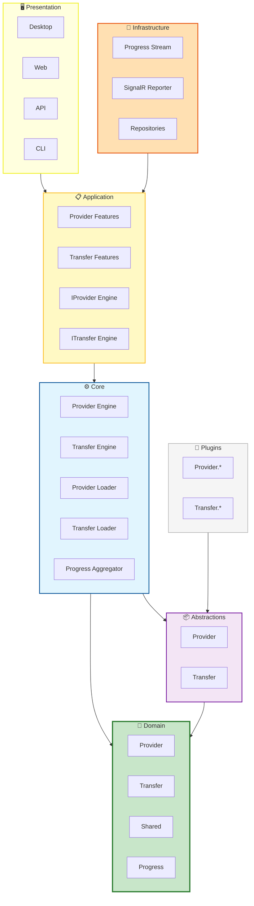
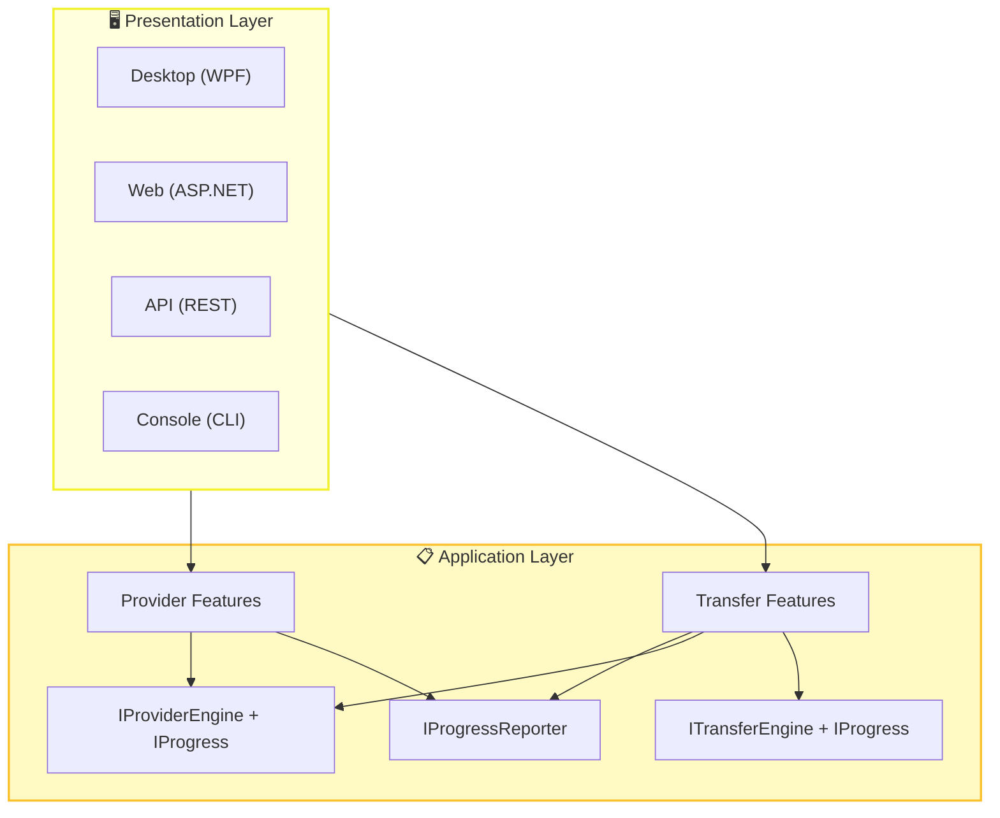
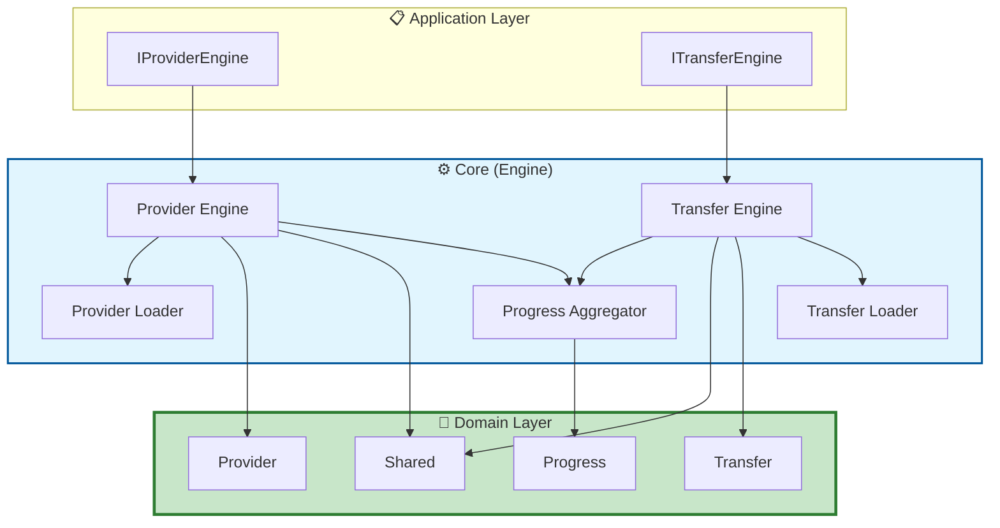
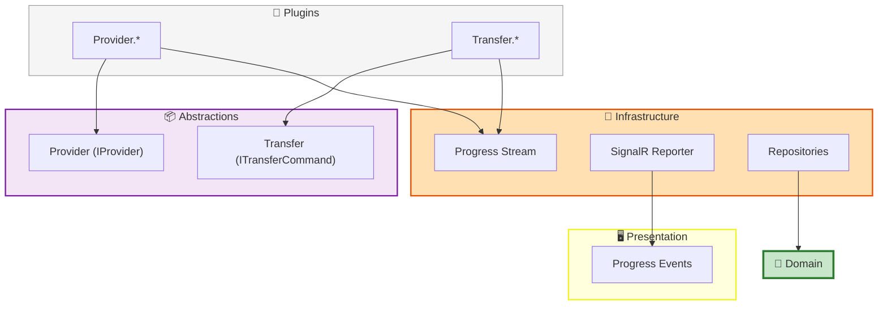
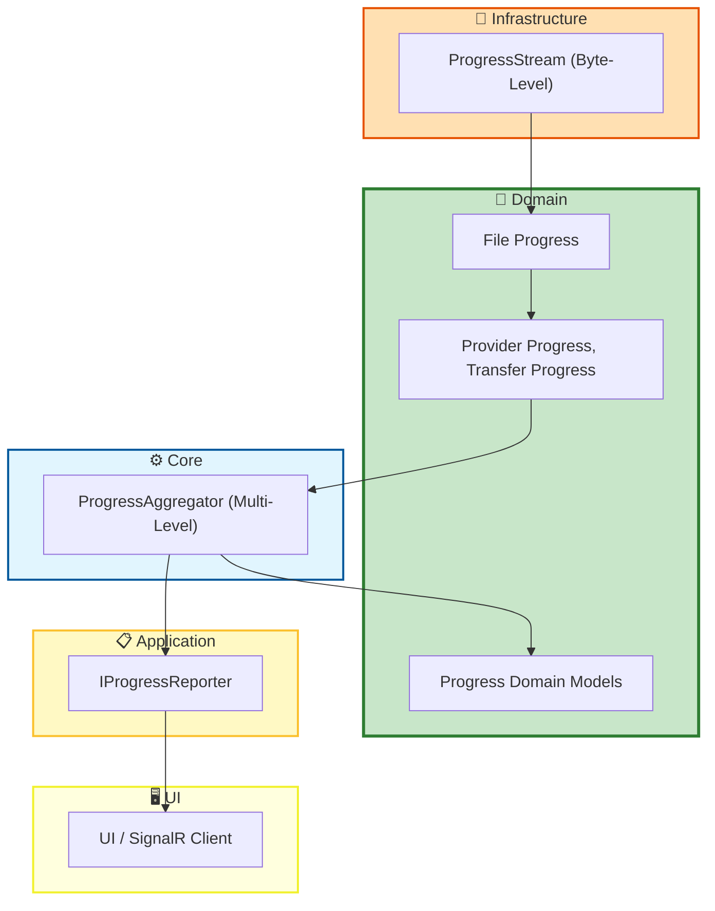
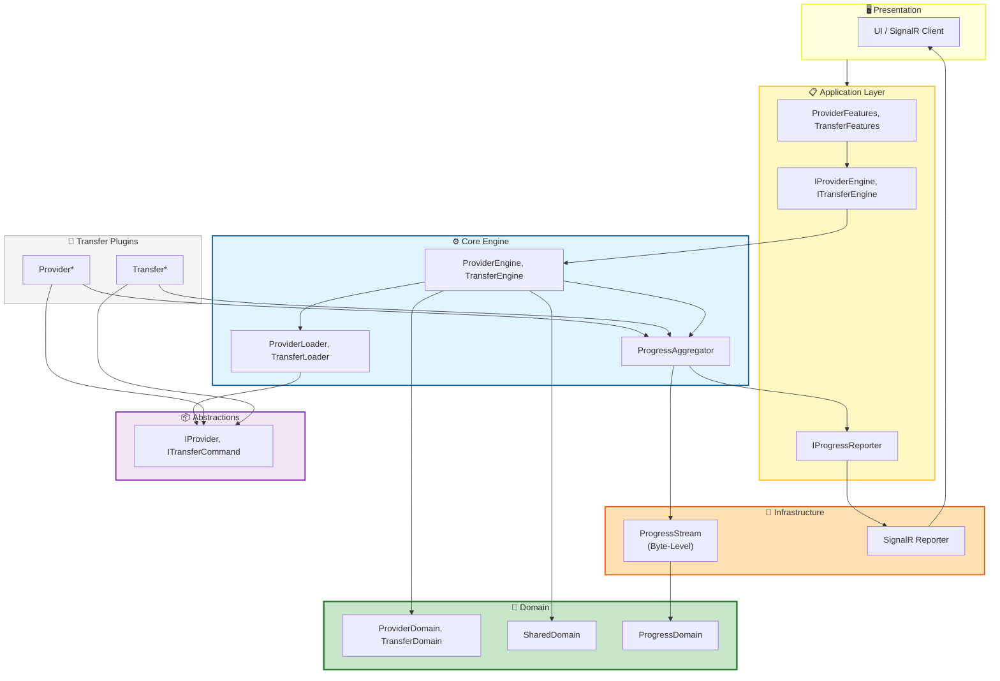
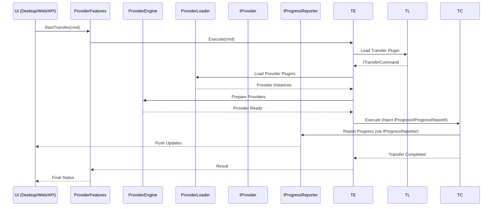
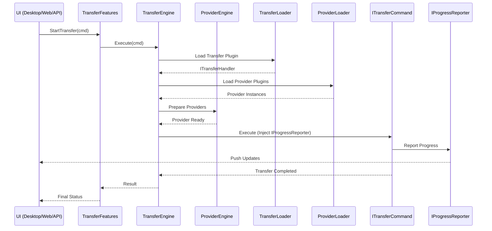

<!-- Migriert aus TransferX\Source\TransferX\docs, Stand: 2026-06-26 -->

# TransferX Architektur

> **plugin-devkit:** Dieses Dokument beschreibt die Gesamtarchitektur von TransferX.
> Für Plugin-Entwickler sind vor allem die Abschnitte **Abstractions**, **Plugin-Discovery** und **Provider/Transfer-Plugins** relevant.
> Runtime-, Deployment- und Infrastructure-Abschnitte dienen als Hintergrundwissen.

Basis Dokumente: [README](../../README.md) und [Coding Standards](../conventions/coding-standards.md)

## Übersicht

### Presentation Layer (UI, API, CLI)

**Rolle:** Kommuniziert ausschließlich über **Application Features** mit der Business‑Logik.

| Element | Bezeichnung    | Beschreibung                                                 |
| ------- | -------------- | ------------------------------------------------------------ |
| Desktop | WPF Desktop UI | Native Windows‑Oberfläche für Interaktion, Konfiguration und Monitoring. |
| Web     | ASP.NET Web UI | Browserbasierte Oberfläche für Remote‑Zugriff und Administration. |
| API     | REST API       | Programmierschnittstelle für externe Systeme, Automatisierung und Integrationen. |
| Console | CLI            | Skript‑ und Automatisierungsoberfläche für DevOps‑ oder Batch‑Szenarien. |

### Application Layer

**Rolle:** Definiert **Use Cases** und **Ports** (Interfaces), die vom Core implementiert und von der UI genutzt werden.

Siehe Dokumentation  [TransferXApplication.md](TransferXApplication.md) 

| Element            | Bezeichnung                | Beschreibung                                                |
| ------------------ | -------------------------- | ----------------------------------------------------------- |
| ProviderFeatures   | Provider‑Funktionen        | Use‑Cases wie Konfiguration, Browsing, Credential‑Handling. |
| TransferFeatures   | Transfer‑Funktionen        | Use‑Cases wie Start, Stop, Fortschritt, Statusabfragen.     |
| ProviderInterfaces | IProviderEngine, IProgress | Port‑Interface für Provider‑Operationen und Forschritt.     |
| TransferInterfaces | ITransferEngine, IProgress | Port‑Interfaces für Transfer‑Operationen und Fortschritt.   |
| ProgressReporter   | IProgressReporter          | Abstraktion für Fortschrittsmeldungen an UI/SignalR.        |

### Core Layer (Engine)

**Rolle:** Zentrale Geschäftslogik, orchestriert Domain‑Objekte und Plugins.

Siehe Dokumentation  [../../README.md](../../README.md) 

| Element            | Bezeichnung                     | Beschreibung                                                 |
| ------------------ | ------------------------------- | ------------------------------------------------------------ |
| ProviderEngine     | Provider Engine                 | Kernlogik für Provider Operationen, Konfiguration, nutzt Progress |
| TransferEngine     | Transfer Engine                 | Kernlogik für Transfers Operation, Konfiguration, nutzt ProviderEngine und Progress |
| ProviderLoader     | Provider Loader                 | Dynamisches Laden von Provider‑Plugins über Abstractions.    |
| TransferLoader     | Transfer Loader                 | Dynamisches Laden von Transfer‑Plugins über Abstractions.    |
| ProgressAggregator | Multi‑Level Progress Aggregator | Aggregiert Fortschritt über mehrere Ebenen (Transfer → File → Byte). |

### Domain Layer

**Rolle:** Reine Domain‑Modelle ohne Abhängigkeiten nach aussen.

Siehe Dokumentation  [TransferXDomain.md](TransferXDomain.md) 

| Element        | Bezeichnung     | Beschreibung                                                 |
| -------------- | --------------- | ------------------------------------------------------------ |
| ProviderDomain | Provider Domain | Value Objects für Config, Credentials, Provider‑Metadaten.   |
| TransferDomain | Transfer Domain | Value Objects für Config, Provider, Transfer, TransferItem, Status, Retry‑Infos. |
| SharedDomain   | Shared Domain   | ContentItem, StorageItem, generische Domain‑Objekte.         |
| ProgressDomain | Progress Domain | TransferProgress, FileProgress, Byte‑Progress.               |

### Abstractions

**Rolle:** Definiert die Plugin‑Schnittstellen für Provider- und Transfer‑Engines.

Siehe Dokumentation  [TransferXAbstractions.md](../architecture/abstractions.md) 

| Element     | Bezeichnung           | Beschreibung                                                 |
| ----------- | --------------------- | ------------------------------------------------------------ |
| ProviderAbs | Provider.Abstractions | Interfaces für Provider (IProvider, IProgress Parameter).    |
| TransferAbs | Transfer.Abstractions | Interfaces für Transfer‑Commands (ITransferCommand) und ProgressAggregator. |

### Infrastructure

**Rolle:** Technische Implementierungen, die Ports aus dem Application Layer bedienen.

Siehe Dokumentation  [TransferXInfrastructure.md](TransferXInfrastructure.md) 

| Element         | Bezeichnung      | Beschreibung                                                 |
| --------------- | ---------------- | ------------------------------------------------------------ |
| ProgressStream  | ProgressStream   | Byte‑Level Tracking für Streams.                             |
| SignalRReporter | SignalR Reporter | Echtzeit‑Broadcast von Fortschritt an Web‑Clients.           |
| Repositories    | Repositories     | Persistenz für Domain‑Objekte (Transfers-, Provider‑Config). |

### Plugins

**Rolle:** Erweiterbare Module, die Abstractions implementieren.

Siehe Dokumentation  [TransferXImplementProviderPlugin.md](../providers/implement-provider-plugin.md) 

| Element  | Bezeichnung | Beschreibung                                                 |
| -------- | ----------- | ------------------------------------------------------------ |
| Provider | Provider.*  | Provider‑Implementierung (Commands/Queries und Progress).    |
| Transfer | Transfer.*  | Transfer‑Implementierung (je Plugin genau ein ITransferCommand mit CommandName, Description und ProgressAggregator). |

## Details: Presentation, Application

## Details: Core, Domain

## Details: Abstractions, Plugins, Infrastructure

## Architecture Decision Records (ADR)

*Übersicht*

| Entscheidung             | Kontext                                                     | Begründung                                      |
| ------------------------ | ----------------------------------------------------------- | ----------------------------------------------- |
| **Abstractions**         | Getrennt: `Provider.Abstractions` & `Transfer.Abstractions` | Klare Trennung, unabhängige Versionierung       |
| **Application Features** | Getrennt: Provider Features & Transfer Features             | Unterschiedliche Use Cases, Nutzer, Komplexität |
| **Command Pattern**      | Für Provider-Operationen & Transfer-Execution               | Testbarkeit, Retry-Fähigkeit, Konsistenz        |
| **Progress Handling**    | Multi-Level IProgress<T> Integration                        | Echtzeit-Feedback, Performance-Tracking         |
| **Core Engines**         | Getrennt: ProviderEngine & TransferEngine                   | TransferEngine nutzt ProviderEngine             |
| **Transfer Command**     | Command basierte Transfer Plugins                           | Erweiterbarkeit auch durch dritte               |

### Abstractions: Provider und Transfer

**Kontext:** Provider und Transfer haben unterschiedliche Verantwortlichkeiten, Lebenszyklen und Erweiterungspunkte. Beide sollen als Plugins erweiterbar sein.

**Entscheidung:** Wir trennen die Abstraktionen in zwei Pakete:

- `Provider.Abstractions`
- `Transfer.Abstractions`

**Konsequenzen (positiv):**

- Unabhängige Versionierung
- Klarere Verantwortlichkeiten
- Plugins können gezielt nur Provider oder nur Transfer betreffen

**Konsequenzen (negativ):**

- Mehr Projekte/Packages
- Höherer initialer Setup‑Aufwand

### Application Features, Command Pattern, Core Engines: Für Provider und Transfer

**Kontext:** Provider Operationen (Browse, Config, Credentials) und Transfer Operationen (Copy, Sync, Config) haben unterschiedliche Komplexität und Use‑Cases.

**Entscheidung:**

- `ProviderEngine` für Provider‑Operationen
- `TransferEngine` für Transfer‑Orchestrierung (nutzt `ProviderEngine`)

**Konsequenzen (positiv):**

- Klare Verantwortlichkeiten
- Transfer Logik kann wachsen, ohne Provider Logik zu verkomplizieren
- Bessere Testbarkeit

**Konsequenzen (negativ):**

- Mehr Interaktion zwischen Engines
- Mehr Schnittstellen (z. B. `IProviderEngine`)

### Progress Handling

**Kontext:** Transfers können sehr gross sein (viele Dateien, große Dateien). UI und API benötigen präzise Fortschrittsinformationen.

**Entscheidung:**

- Byte‑Level: `ProgressStream`
- File‑Level: `FileProgress`
- Transfer‑Level: `TransferProgress`
- Aggregation: `ProgressAggregator`
- Reporting: `IProgressReporter` → SignalR → UI

**Konsequenzen (positiv):**

- Sehr präzise Fortschrittsanzeige
- Gute UX in UI
- Skalierbar für große Transfers

**Konsequenzen (negativ):**

- Höhere Komplexität im Progress‑System
- Mehr Objekte und Events

### Domain ist abhängigkeitsfrei

**Kontext:** Domain‑Modelle sollen langfristig stabil, testbar und unabhängig von Infrastruktur bleiben.

**Entscheidung:**

- Domain Layer kennt **keine** anderen Layer
- Alle anderen Layer dürfen Domain referenzieren

**Konsequenzen (positiv):**

- Hohe Testbarkeit
- Langlebige Domain‑Modelle
- Saubere Clean‑Architecture‑Trennung

**Konsequenzen (negativ):**

- Mapping‑Aufwand in Application/Core
- Kein direkter Zugriff auf Infrastruktur aus Domain

### Command‑basierte Transfer‑Plugins

**Kontext:** Transfer‑Plugins sollen unabhängig voneinander erweiterbar sein.
Third‑Party‑Plugins sollen ohne Core‑Änderungen integrierbar sein.

**Entscheidung:**

- Jedes Transfer‑Plugin implementiert genau **ein Command** (`ITransferCommand`)
- Plugin‑Discovery erfolgt über `[TransferMetadata]`‑Attribut
- Metadaten (`CommandName`, `Description`, `Version`) werden über das Interface bereitgestellt
- Ausführung erfolgt einheitlich über `ExecuteAsync()` – Command‑Name dient nur als Information

**Konsequenzen (positiv):**

- Beliebig viele Commands ohne Core‑Änderungen erweiterbar
- Third‑Party‑Plugin‑fähig
- Single Responsibility: Ein Plugin = Ein Command

**Konsequenzen (negativ):**

- 

## Abhängigkeitsregeln

| Von → Nach                   | Erlaubt? | Regel                                                   |
| ---------------------------- | -------- | ------------------------------------------------------- |
| Presentation → Application   | ✅ Ja     | Nur über Features                                       |
| Application → Core           | ✅ Ja     | Über Interfaces (Ports)                                 |
| Core → Domain                | ✅ Ja     | Direkt                                                  |
| Core → Abstractions          | ✅ Ja     | Für Plugin-Loading                                      |
| Plugins → Abstractions       | ✅ Ja     | Implementieren Interfaces (IProvider, ITransferCommand) |
| Abstractions → Domain        | ✅ Ja     | Nutzen Value Objects                                    |
| Infrastructure → Application | ✅ Ja     | Implementieren Ports                                    |
| Domain → ❌ Alle              | ❌ Nein   | **Keine** Abhängigkeiten nach außen                     |
| Transfer → Provider          | ✅ Ja     | Via IProviderEngine                                     |
| Provider → Transfer          | ❌ Nein   | Provider kennt Transfer nicht                           |

## Erweiterbarkeit

### Neue Provider hinzufügen

Ein neuer Provider muss:

- `IProvider` implementieren
- `IProgress` unterstützen
- in `Provider.Abstractions` registriert werden
- über `ProviderLoader` geladen werden

**Beispiele:** WebDAV, FTP

Siehe Dokument  [TransferXImplementProviderPlugin.md](../providers/implement-provider-plugin.md) 

### Neue Transfer hinzufügen

Ein neuer Transfer muss:

- `ITransferCommand` implementieren (genau ein Command pro Plugin)
- `[TransferMetadata]` Attribut besitzen (Plugin-Discovery)
- `CommandName` und `Description` über das Interface bereitstellen
- Progress an `ProgressAggregator` melden
- über `TransferLoader` geladen werden

**Beispiele:** Copy, Sync, Backup, Mirror

## Implementationen

### Progress System

Das Fortschrittssystem ist **mehrstufig**:

1. **Byte‑Level** (ProgressStream)
2. **File‑Level** (FileProgress)
3. **Transfer‑Level** (TransferProgress)
4. **Aggregiert** (ProgressAggregator)
5. **Reported** (IProgressReporter → SignalR → UI)

Vorteile:

- Echtzeit‑Feedback
- Präzise Fortschrittsanzeige
- Skalierbar für große Transfers
- UI‑freundlich

*Zeigt Byte‑Tracking, Aggregation und Reporting.*

### Plugin Ladeprozess

1. Core lädt Abstractions
2. ProviderLoader/TransferLoader scannt Assemblies
3. Implementierungen werden instanziiert
4. Engines nutzen die geladenen Plugins

Vorteile:

- Hot‑Swap möglich
- Keine Core‑Änderungen notwendig
- Saubere Trennung von Domain und Implementierung

*Note: Transfer lädt Provider Plugins*

### Sequenz: Provider

###  Sequenz: Transfer

------

1. UI startet Transfer über `TransferFeatures`
2. Application Layer ruft `ITransferEngine` auf
3. TransferEngine lädt ProviderEngine
4. ProviderEngine lädt Provider Plugins
5. TransferEngine orchestriert Transfer
6. IProgressReporter forward to ProgressReporter sammelt Fortschritt
7. ProgressReporter sendet Updates an UI

