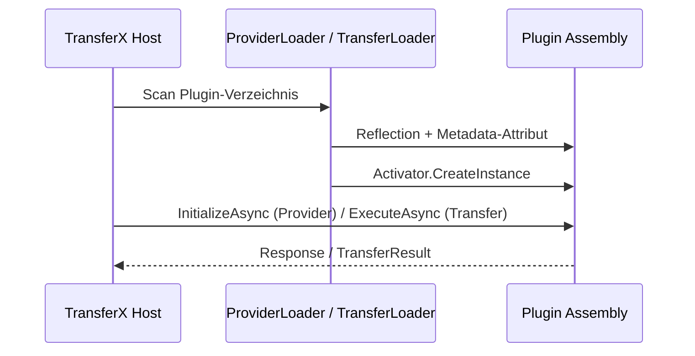

# Plugin-Lifecycle

<!-- Abgeleitet aus TransferX Implement-Guides und Core-Dokumentation, Stand: 2026-06-26 -->

Lebenszyklus eines TransferX-Plugins von der Discovery bis zum Deployment.

## Übersicht



## 1. Build

Plugin als .NET 8 Class Library mit NuGet-Referenz auf Abstractions:

- Provider: `TransferX.Provider.Abstractions`
- Transfer: `TransferX.Transfer.Abstractions`

Versionen aus [sdk/package-versions.json](../../sdk/package-versions.json).

## 2. Discovery

### Provider

Der `ProviderLoader` scannt Assemblies nach Klassen mit:

1. `[ProviderMetadata]`-Attribut
2. `IProvider`-Implementierung
3. **Parameterlosem Konstruktor**

### Transfer

Der `TransferLoader` scannt nach:

1. `[TransferMetadata]`-Attribut
2. `ITransferCommand`-Implementierung
3. Genau **ein** Command pro Assembly

## 3. Instanziierung — kritischer Fallstrick

Plugins werden per `Activator.CreateInstance(typeof(MyProvider))` erzeugt.

**Primary Constructor mit optionalen Parametern reicht nicht:**

```csharp
// FALSCH — MissingMethodException im Host
public sealed class MyProvider(ILoggerFactory? loggerFactory = null) : IProvider

// RICHTIG
public sealed class MyProvider : IProvider
{
    public MyProvider() : this(null) { }
    public MyProvider(ILoggerFactory? loggerFactory) { /* ... */ }
}
```

Konfiguration erfolgt ueber `InitializeAsync`, nicht ueber den Konstruktor.

## 4. Initialisierung (Provider)

Vor der ersten Operation ruft der Host `InitializeAsync(ProviderConfigItem)` auf.

Typische Validierungen:

- `BasePath` nicht leer
- Verzeichnis/Endpoint existiert
- Credentials gesetzt (falls erforderlich)

## 5. Ausführung

### Provider

`ExecuteAsync(ProviderRequest)` dispatcht per Typ-Switch an Commands/Queries.

### Transfer

`ExecuteAsync(TransferConfigItem, sourceProvider, targetProvider, progress, ct)` orchestriert Provider-Aufrufe.

## 6. Deployment

Kompilierte `.dll` (inkl. transitive Abhaengigkeiten des Plugins) ins Plugin-Verzeichnis:

```text
{ProviderPluginDir}/
    TransferX.Provider.MyProvider.dll
    ... transitive Abhaengigkeiten ...

{TransferPluginDir}/
    TransferX.Transfer.MyCommand.dll
    ...
```

Shared Assemblies (`TransferX.Provider.Abstractions.dll`, `TransferX.Domain.dll`) stellt der Host bereit.

### Plugin-Pfad-Aufloesung

| Eingabe | Ergebnis |
| --- | --- |
| Absoluter Pfad | Direkt verwendet |
| Relativer Pfad | Kombination mit globalem Plugin-Verzeichnis |
| Leer | Globales Plugin-Verzeichnis |

## 7. Versionierung

- Assembly-Version aus Build (siehe `Directory.Build.props` in Plugin-Repos)
- `IProvider.Version` / `ITransferCommand.Version` zur Laufzeit ablesbar
- NuGet-Abstractions-Version unabhaengig von Plugin-Version

## Weiterführend

- [implement-provider-plugin.md](../providers/implement-provider-plugin.md) — Abschnitt Plugin-Discovery
- [implement-transfer-plugin.md](../transfers/implement-transfer-plugin.md) — Abschnitt Plugin-Discovery
- [abstractions.md](abstractions.md)
