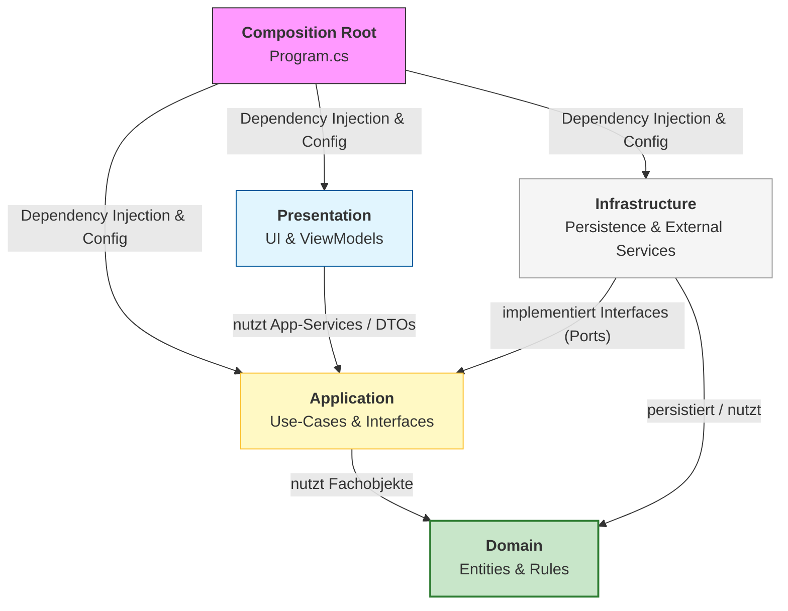
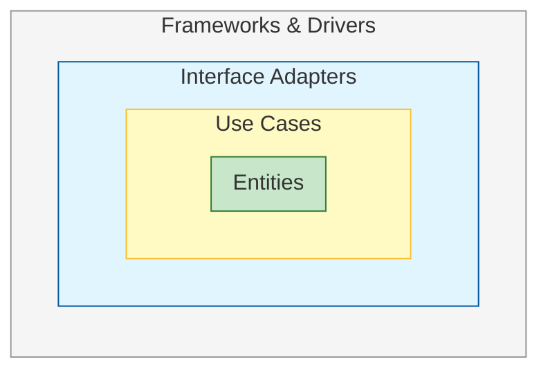
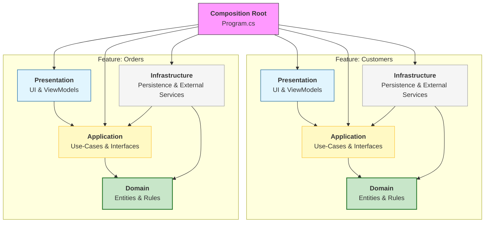
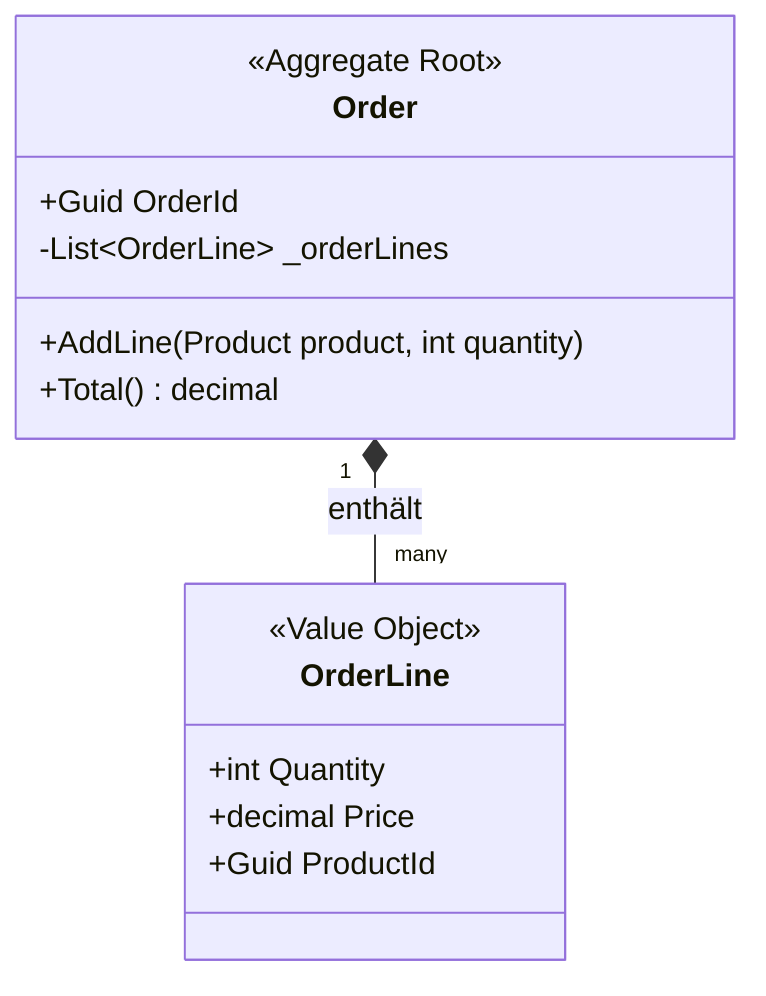
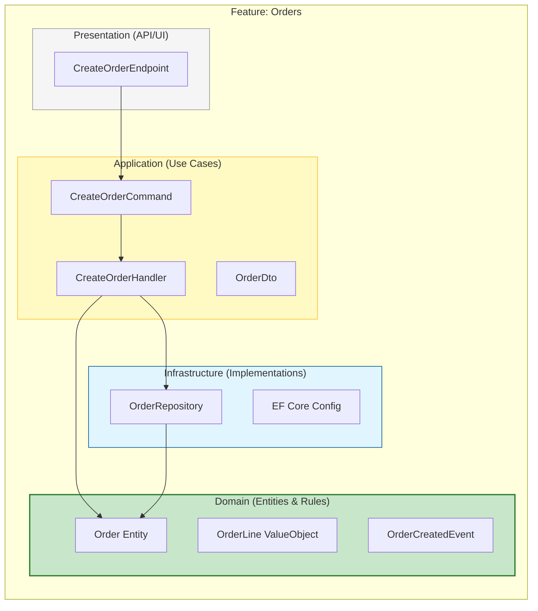

<!-- Migriert aus TransferX\Source\TransferX\docs, Stand: 2026-06-26 -->

# Clean Architecture & Coding Standards 

 Best Practices für C#‑Projekte




| Schicht / Projekt    | Verantwortung / Inhalt                                       |
| -------------------- | ------------------------------------------------------------ |
| **Composition Root** | App‑Start, *Dependency Injection*, Konfiguration, Options‑Binding (`Program.cs`). |
| **Presentation**     | UI (Razor Pages), WPF, `PageModel`, Input‑Validierung, Mapping auf DTOs/ViewModels, Lokalisierung über `.resx`. Keine Fachlogik. |
| **Application**      | Use‑Cases / Anwendungslogik (Orchestrierung), Commands/Queries, DTOs, Ports/Interfaces (z. B. `IOrderRepository`). Keine UI- und keine DB‑Details. |
| **Domain**           | Fachlicher Kern (Core Business): Entities, Value Objects, Invarianten/Regeln, Domain Events. Keine Abhängigkeit zu EF Core, ASP.NET Core, UI. |
| **Infrastructure**   | Technische Details: DB/EF Core, Repository‑Implementierungen, externe Services (HTTP, Mail, File), Caching, Identity‑Adapter. Referenziert `Application`/`Domain`, nicht umgekehrt. |

[Clean Architecture: Simplified and In-Depth Guide | by DrunknCode | Medium](https://medium.com/@DrunknCode/clean-architecture-simplified-and-in-depth-guide-026333c54454)

[Clean Architecture Reference Guide: Everything You Need to Know About Clean Architecture | Bitloops Docs](https://bitloops.com/docs/bitloops-language/learning/software-architecture/clean-architecture)

[Clean Code and Clean Architecture | by Configr Technologies | Stackademic](https://blog.stackademic.com/clean-code-and-clean-architecture-f5b155a2c31a)

## 1. Clean Architecture & Feature Isolation

Clean Architecture trennt Software in klar definierte Schichten, sodass Geschäftslogik unabhängig von Frameworks, UI und Datenquellen bleibt. Dadurch entsteht ein System, die testbar, flexibel und langfristig wartbar sind.



Ergänzend sorgt Feature Isolation (Vertical Slice Architecture) dafür, dass Use‑Cases und fachliche Funktionen vertikal gekapselt werden. Zusammen entsteht eine Architektur, die sowohl technisch sauber als auch fachlich modular ist.



Softwarearchitektur – Grundlagen  
https://learn.microsoft.com/de-de/azure/architecture/guide/

## 2. Dependency Rule

Die Dependency Rule besagt, dass alle Abhängigkeiten nur nach innen zur Domäne zeigen dürfen, nie von der Domain nach außen. So bleibt die Geschäftslogik unabhängig von technischen Details wie Datenbanken, UI oder Frameworks.

```csharp
public interface IOrderRepository
{
    Task<int> AddAsync(Order order);
}
```

Architekturprinzipien (inkl. Dependency Inversion)  
https://learn.microsoft.com/de-de/azure/architecture/guide/design-principles/

## 3. Schichtenmodell & Aufgaben

```
Domain
 ├─ Entities
 ├─ Value Objects
 └─ Domain Rules

Application
 ├─ Use Cases
 ├─ DTOs
 └─ Interfaces

Infrastructure
 ├─ Persistence
 ├─ External Services
 └─ Implementations

Presentation
 ├─ API / Controllers
 └─ UI
```

Das Schichtenmodell sorgt dafür, dass jede Ebene eine klar abgegrenzte Verantwortung hat. Änderungen in UI oder Infrastruktur beeinflussen die Domäne so wenig wie möglich.

| Layer              | Aufgabe                                                      |
| ------------------ | ------------------------------------------------------------ |
| **Domain**         | Geschäftslogik (use case), Entities, Value Objects, Regeln, Repository-Interface. <br />Unabhänig von Frameworks, UI, Datenbanken. <br />Alle Abhängigkeiten zeigen *nach innen* (Dependency Rule) |
| **Application**    | Interface, Use‑Case‑Orchestrierung, DTOs, Services. <br />Kommuniziert nur über *Interface* mit Domain & Infrastruktur. <br />Keine UI- oder Datenbanklogik. |
| **Infrastructure** | Implementierung Repository-Interface, Datenzugriff, APIs, ORM (EF Core), externe Systeme, Implementierungen |
| **Presentation**   | UI, Controller (MVC, Razor Pages), API‑Endpoints. <br />Ruft Use Cases auf, enthält *keine Gechäftslogik* |

*Beispiel‑Entity*

```csharp
public class Order
{
    public int Id { get; }
    public decimal Amount { get; }

    public Order(int id, decimal amount)
    {
        if (amount <= 0)
            throw new ArgumentException("Amount must be positive.");

        Id = id;
        Amount = amount;
    }
}
```

*Beispiel‑Use‑Case*

```csharp
public class CreateOrder
{
    private readonly IOrderRepository _repo;

    public CreateOrder(IOrderRepository repo)
    {
        _repo = repo;
    }

    public Task<int> ExecuteAsync(decimal amount)
    {
        var order = new Order(0, amount);
        return _repo.AddAsync(order);
    }
}
```

*Beispiel‑Repository‑Implementierung*

```csharp
public class OrderRepository : IOrderRepository
{
    private readonly AppDbContext _db;

    public OrderRepository(AppDbContext db)
    {
        _db = db;
    }

    public async Task<int> AddAsync(Order order)
    {
        _db.Orders.Add(order);
        await _db.SaveChangesAsync();
        return order.Id;
    }
}
```

*Beispiel‑API‑Controller*

```csharp
[ApiController]
[Route("api/orders")]
public class OrdersController : ControllerBase
{
    private readonly CreateOrder _createOrder;

    public OrdersController(CreateOrder createOrder)
    {
        _createOrder = createOrder;
    }

    [HttpPost]
    public async Task<IActionResult> Create(decimal amount)
    {
        var id = await _createOrder.ExecuteAsync(amount);
        return Ok(new { OrderId = id });
    }
}
```

Architektur‑Stile & Schichtenmodelle  
https://learn.microsoft.com/de-de/azure/architecture/guide/architecture-styles/

## 4. Projektstruktur 

Die physische Projektstruktur in Visual Studio sollte das logische Schichtenmodell widerspiegeln. So wird die Architektur im Code sichtbar und ist für alle Teammitglieder intuitiv nachvollziehbar.

```text
src/
 ├── Project.Domain
 ├── Project.Application
 ├── Project.Infrastructure
 ├── Project.Api 
 └── Project.Web / Desktop 
 
```

.NET Projektstruktur & Best Practices  
https://learn.microsoft.com/de-de/dotnet/architecture/modern-web-apps-azure/

## 5. Architektur‑Guidelines

Architektur‑Guidelines stellen sicher, dass die Struktur auch bei wachsender Codebasis stabil bleibt. Sie helfen, Abhängigkeiten zu kontrollieren und technische Entscheidungen von der Geschäftslogik zu entkoppeln.

| Prinzip                         | Bedeutung                                                    |
| ------------------------------- | ------------------------------------------------------------ |
| **Independence of Frameworks**  | Frameworks sind austauschbare Details                        |
| **Separation of Concerns**      | Jede Schicht hat eine klar abgegrenzte Aufgabe               |
| **Interface‑Driven Design**     | Kommunikation über Interfaces statt Implementierungen        |
| **Testability**                 | Domain & Use Cases isoliert testbar                          |
| **Business Logic Independence** | Geschäftslogik bleibt frei von technischen Details (UI, DB, Frameworks) |
| **Feature Isolation**           | Modularität durch vertikale Slices; Features sind klar gekapselt |
| **Layer Stability**             | Wartbarkeit durch definierte Schichten                       |
| **Technology Flexibility**      | Austauschbarkeit von UI, Datenbank oder Infrastruktur ohne Domänenänderung |

Design‑Prinzipien (SOLID, DRY, KISS, SoC)  
https://learn.microsoft.com/de-de/azure/architecture/guide/design-principles/

# 6. Domain‑Driven Design (DDD)

DDD ergänzt Clean Architecture, indem es die inhaltliche Gestaltung der Domäne in den Mittelpunkt stellt. Ziel ist ein Modell, das die Fachlichkeit präzise abbildet und gemeinsam mit den Fachexperten entwickelt wird.

## 6.1 Kernkonzepte

DDD arbeitet mit einem Set klarer Bausteine, um die Domäne zu strukturieren. Diese helfen, Fachlogik explizit zu machen und technische Details außen vor zu lassen.

| Konzept                 | Bedeutung                                 |
| ----------------------- | ----------------------------------------- |
| **Ubiquitous Language** | Gemeinsame Sprache von Fach & Entwicklung |
| **Entities**            | Objekte mit Identität                     |
| **Value Objects**       | Unveränderliche Werte ohne Identität      |
| **Aggregates**          | Konsistenzgrenzen                         |
| **Aggregate Root**      | Einstiegspunkt eines Aggregats            |
| **Domain Events**       | Fachliche Ereignisse                      |
| **Repositories**        | Zugriff auf Aggregate                     |

DDD – Domain Model  
https://learn.microsoft.com/de-de/azure/architecture/microservices/model/domain-model

## 6.2 Aggregate

Ein Aggregate bündelt logisch zusammengehörende *Daten und Regeln* hinter einer Root, um Konsistenz und Invarianten zentral zu halten. Alle Zugriffe laufen über die Aggregate Root. Beispiel: 



DDD – Domain Model  
https://learn.microsoft.com/de-de/azure/architecture/microservices/model/domain-model

## 6.3 Entity & Value Object

Entities repräsentieren Objekte mit Identität, Value Objects fassen Werte zusammen, die durch ihre Eigenschaften definiert sind. Zusammen bilden sie die Grundlage für ein reiches Domänenmodell.

```csharp
public record Money(decimal Amount);

public class Order
{
    private readonly List<OrderLine> _lines = new();
    public IReadOnlyCollection<OrderLine> Lines => _lines;

    public void AddLine(int productId, Money price, int quantity)
        => _lines.Add(new OrderLine(productId, price, quantity));
}

public class OrderLine
{
    public int ProductId { get; }
    public Money Price { get; }
    public int Quantity { get; }

    public OrderLine(int productId, Money price, int quantity)
    {
        ProductId = productId;
        Price = price;
        Quantity = quantity;
    }
}
```

DDD – Entities & Value Objects  
https://learn.microsoft.com/de-de/azure/architecture/microservices/model/domain-model#entities-and-value-objects

## 6.4 Zusammenspiel mit Clean Architecture

Clean Architecture liefert das technologische Gerüst, DDD füllt die Domänenschicht mit fachlich sauberen Modellen. Gemeinsam verhindern sie, dass Geschäftslogik in Controller, ORM‑Modelle oder Infrastruktur abrutscht.

| Clean Architecture      | DDD‑Bezug                        |
| ----------------------- | -------------------------------- |
| Entities                | Entities & Value Objects         |
| Use Cases               | Application Services / Use Cases |
| Domain Layer im Zentrum | Bounded Context / Domänenkern    |

DDD – Strategic Design (Bounded Contexts)  
https://learn.microsoft.com/de-de/azure/architecture/microservices/model/domain-driven-design

# 7. Design‑Patterns

```
CQS:
  Command = Zustand ändern
  Query   = Daten lesen

Factory:
  Erzeugt komplexe Objekte/Requests

Strategy:
  Austauschbare Policies (z.B. UploadPolicy)

Facade:
  Einfache API über komplexen Abläufen

Parser:
  XML/JSON → Domain-Objekte
```

Design‑Patterns liefern erprobte Lösungsansätze für wiederkehrende Struktur‑ und Verhaltensprobleme. In Kombination mit Clean Architecture und DDD sorgen sie für klaren, gut wartbaren Code.

## 7.1 Command/Query Separation (CQS)

CQS trennt Operationen in solche, die Zustand ändern (Commands), und solche, die nur lesen (Queries). Das erhöht Verständlichkeit und erleichtert Testbarkeit.

```csharp
public interface ICommand<TRequest, TResponse>
{
    Task<TResponse> ExecuteAsync(TRequest request, CancellationToken ct = default);
}
```

CQRS Pattern  
https://learn.microsoft.com/de-de/azure/architecture/patterns/cqrs

## 7.2 Factory Pattern

Factories kapseln die Erstellung komplexer Objekte oder Requests, sodass Erzeugungslogik nicht in der Geschäftslogik verstreut wird.

```csharp
public interface IRequestFactory
{
    HttpRequestMessage CreateGetRequest(string path);
}
```

Factory Method Pattern  
https://learn.microsoft.com/de-de/azure/architecture/patterns/factory-method

## 7.3 Strategy Pattern

Strategien kapseln austauschbare Verhaltensweisen (z. B. Upload‑Politiken oder Retry‑Strategien), ohne dass der aufrufende Code geändert werden muss.

```csharp
public interface IUploadPolicy
{
    void Apply(HttpRequestMessage request, UploadRequest upload);
}
```

Strategy Pattern  
https://learn.microsoft.com/de-de/azure/architecture/patterns/strategy

## 7.4 Facade Pattern

Eine Fassade versteckt komplexe Abläufe hinter einer einfachen API und entkoppelt Clients von internen Services. Das vereinfacht die Nutzung und reduziert Abhängigkeiten.

```csharp
public class DocumentProviderFacade : IDocumentProvider
{
    private readonly IRequestFactory _requestFactory;
    private readonly IResponseParser _parser;
    private readonly HttpClient _httpClient;

    public DocumentProviderFacade(
        IRequestFactory requestFactory,
        IResponseParser parser,
        HttpClient httpClient)
    {
        _requestFactory = requestFactory;
        _parser = parser;
        _httpClient = httpClient;
    }

    public async Task<ListDocumentsResponse> ListDocumentsAsync(string path, CancellationToken ct = default)
    {
        var request = _requestFactory.CreateGetRequest(path);
        var response = await _httpClient.SendAsync(request, ct);
        return await _parser.ParseListDocumentsAsync(response, ct);
    }
}
```

Facade Pattern  
https://learn.microsoft.com/de-de/azure/architecture/patterns/facade

## 7.5 Parser Pattern

Parser kapseln die Transformation externer Datenformate (XML, JSON, etc.) in Domain‑Objekte. So bleibt das Domänenmodell frei von Format‑ und Protokoll‑Details.

```csharp
public interface IResponseParser
{
    Task<ListDocumentsResponse> ParseListDocumentsAsync(HttpResponseMessage response, CancellationToken ct = default);
}

public class XmlDocumentResponseParser : IResponseParser
{
    public async Task<ListDocumentsResponse> ParseListDocumentsAsync(HttpResponseMessage response, CancellationToken ct = default)
    {
        var xml = await response.Content.ReadAsStringAsync(ct);
        var xDoc = XDocument.Parse(xml);

        var items = xDoc.Descendants("item")
            .Select(x => new DocumentItem(
                name: (string)x.Element("name")!,
                size: (long?)x.Element("size") ?? 0,
                modified: DateTime.Parse((string)x.Element("modified")!)
            ))
            .ToList();

        return new ListDocumentsResponse(items);
    }
}
```

Adapter Pattern (offizielles Microsoft‑Äquivalent)  
https://learn.microsoft.com/de-de/azure/architecture/patterns/adapter

# 8. Implementierungsregeln

- **Horizontal**: technische Trennung (Domain, Application, Infra, UI)
- **Vertikal**: fachliche Trennung (z.B. Orders, Customers, Billing)
- **DDD** liefert das Modell im Zentrum
- **CQS/CQRS** strukturiert Use‑Cases pro Feature



```c#
// Command Interface
Task<TResponse> ExecuteAsync(TRequest req, CancellationToken ct);

// Entity
public class Order { List<OrderLine> _lines; }

// Retry‑fähiger Stream
using var s = await req.ContentFactory(ct);

// TLS‑Client
RemoteCertificateValidationCallback = (_,_,_,e) => e == None;
```

Implementierungsregeln übersetzen Architektur‑ und Design‑Entscheidungen in konkrete Vorgaben für den Code. Sie helfen, Konsistenz und Robustheit im Alltag sicherzustellen.

## 8.1 Async First + CancellationToken

I/O‑Operationen sollten standardmäßig asynchron sein und einen `CancellationToken` akzeptieren. So bleiben Anwendungen reaktionsfähig und können sauber abgebrochen werden.

```csharp
public async Task<UploadResponse> ExecuteAsync(
    UploadRequest request,
    CancellationToken cancellationToken = default)
{
    using var stream = await request.ContentFactory(cancellationToken);
    // Upload-Logik
}
```

Asynchrone Programmierung in C#  
https://learn.microsoft.com/de-de/dotnet/csharp/asynchronous-programming/

## 8.2 Retry‑fähige Streams

Für Uploads oder Downloads sollte der Inhalt über eine Factory bereitgestellt werden. Dadurch kann der Stream bei Retries neu erzeugt werden, ohne falsch wiederverwendet zu werden.

```csharp
public class UploadRequest
{
    public string TargetPath { get; init; } = default!;
    public Func<CancellationToken, Task<Stream>> ContentFactory { get; init; } = default!;
}

public class UploadCommand : ICommand<UploadRequest, UploadResponse>
{
    private readonly HttpClient _client;

    public UploadCommand(HttpClient client) => _client = client;

    public async Task<UploadResponse> ExecuteAsync(UploadRequest request, CancellationToken ct = default)
    {
        using var stream = await request.ContentFactory(ct);

        var httpRequest = new HttpRequestMessage(HttpMethod.Put, request.TargetPath)
        {
            Content = new StreamContent(stream)
        };

        var response = await _client.SendAsync(httpRequest, ct);
        return new UploadResponse(response.IsSuccessStatusCode);
    }
}
```

Resilienz & Retry‑Strategien (Polly)  
https://learn.microsoft.com/de-de/dotnet/core/resilience/

## 8.3 Domain‑spezifische Exceptions

Fehler sollten mit fachlich sinnvollen Exceptions signalisiert werden, statt mit generischen technischen Fehlern. Das erleichtert Logging, Monitoring und Fehlersuche.

```csharp
public class ProviderException : Exception
{
    public ProviderException(string message, Exception inner)
        : base(message, inner) { }
}
```

Exception‑Design‑Guidelines  
https://learn.microsoft.com/de-de/dotnet/standard/design-guidelines/exceptions

# 9. Naming Conventions

Konsistente Benennung macht Code vorhersagbar und leicht lesbar. Entwickler können sich auf Inhalte statt auf Stilunterschiede konzentrieren.

| Element             | Konvention              | Beispiel           |
| ------------------- | ----------------------- | ------------------ |
| Klassen             | PascalCase              | `OrderService`     |
| Interfaces          | I‑Prefix + PascalCase   | `IOrderRepository` |
| Methoden            | PascalCase              | `CalculateTotal()` |
| Async‑Methoden      | Async‑Suffix            | `LoadDataAsync()`  |
| Private Felder      | _camelCase              | `_logger`          |
| Parameter/Variablen | camelCase               | `orderId`          |
| DTOs                | Request/Response Suffix | `UploadRequest`    |
| Enums               | Singular                | `TransferStatus`   |

.NET Namenskonventionen  
https://learn.microsoft.com/de-de/dotnet/standard/design-guidelines/naming-guidelines

# 10. Clean Code

Clean Code sorgt dafür, dass die Architektur im Alltag nicht „kaputtrefaktoriert“ wird. Lesbarkeit, Klarheit und Einfachheit stehen im Vordergrund.

## 10.1 Prinzipien

Diese Grundprinzipien helfen, unnötige Komplexität zu vermeiden und den Fokus auf das Wesentliche zu legen.

| Prinzip |  | Bedeutung |
|--------|----------------|-----------|
| **KISS** | *Keep It Simple, Stupid* | Lösungen so einfach wie möglich halten. Keine unnötige Komplexität, keine übertriebenen Abstraktionen. |
| **DRY** | *Don’t Repeat Yourself* | Wiederholungen vermeiden. Logik, Regeln und Strukturen nur einmal definieren, um Fehlerquellen und Wartungsaufwand zu reduzieren. |
| **YAGNI** | *You Aren’t Gonna Need It* | Nichts implementieren, was aktuell nicht benötigt wird. Keine vorzeitigen Erweiterungspunkte oder Features einbauen. |

Design‑Prinzipien (KISS, DRY, SoC, etc.)  
https://learn.microsoft.com/de-de/azure/architecture/guide/design-principles/

## 10.2 Methoden‑ & Klassenstruktur

Kleine, fokussierte Methoden und Klassen mit klarer Verantwortung sind leichter zu verstehen, zu testen und zu ändern.

| Element         | Empfehlung      |
| --------------- | --------------- |
| Methoden        | 5–15 Zeilen     |
| Parameter       | max. 3–4        |
| Verschachtelung | max. 2–3 Ebenen |

.NET Design Guidelines  
https://learn.microsoft.com/de-de/dotnet/standard/design-guidelines/

## 10.3 Fehlerbehandlung

Fehler sollen klar und eindeutig sein und nicht als Kontrollfluss missbraucht werden. Ausnahmen sollten gezielt und sparsam eingesetzt werden.

```csharp
if (amount <= 0)
    throw new ArgumentException("Amount must be positive.");
```

Exception‑Guidelines  
https://learn.microsoft.com/de-de/dotnet/standard/design-guidelines/exceptions

# 11. Testing

Tests sollten die Struktur des Produktionscodes widerspiegeln und das Verhalten der Software überprüfen, nicht interne Implementierungsdetails. So bleiben Tests robust gegenüber Refactorings.

```text
Project.Tests/
 └── Application/
 └── Domain/
 └── Infrastructure/
```

Unit Testing in .NET  
https://learn.microsoft.com/de-de/dotnet/core/testing/

# 12. Security & Operations

Security‑ und Betriebsaspekte müssen von Anfang an mitgedacht werden. Sie betreffen Konfiguration, Datenhaltung, Kommunikation und Fehlerbehandlung.

## 12.1 Data Protection API

Sensible Informationen wie Passwörter oder Tokens sollten niemals im Klartext gespeichert werden. Eine Schutz‑Abstraktion erleichtert den Austausch der zugrunde liegenden Technologie.

```csharp
public interface ICredentialProtector
{
    string Protect(string plainText);
    string Unprotect(string encryptedText);
}
```

ASP.NET Core Data Protection  
https://learn.microsoft.com/de-de/aspnet/core/security/data-protection/introduction

## 12.2 HTTPS/TLS

Kommunikation mit externen Systemen sollte standardmäßig über HTTPS erfolgen. Je nach Legacy‑Umgebung kann das Validierungsverhalten konfigurierbar gemacht werden, ohne Sicherheit zu verwässern.

```csharp
public class ConnectionSettings
{
    public bool UseSsl { get; set; } = true;
}

public static class HttpClientFactoryExtensions
{
    public static IHttpClientBuilder AddSecureClient(
        this IServiceCollection services,
        ConnectionSettings settings)
    {
        return services.AddHttpClient("SecureClient")
            .ConfigurePrimaryHttpMessageHandler(() =>
            {
                return new SocketsHttpHandler
                {
                    SslOptions = new SslClientAuthenticationOptions
                    {
                        RemoteCertificateValidationCallback = (sender, cert, chain, errors) =>
                        {
                            if (settings.UseSsl)
                                return errors == SslPolicyErrors.None;

                            // Optionaler Legacy-Fallback
                            return true;
                        }
                    }
                };
            });
    }
}
```

HTTPS erzwingen & TLS‑Konfiguration  
https://learn.microsoft.com/de-de/aspnet/core/security/enforcing-ssl

# 13. Tooling & CI/CD

Tooling und Pipelines stellen sicher, dass Qualitätsstandards automatisch überprüft und Builds reproduzierbar sind. Sie machen Architektur‑ und Coding‑Regeln im Alltag wirksam.

## 13.1 Tooling

Analyser, Code‑Style‑Regeln und IDE‑Erweiterungen helfen, Fehler früh zu erkennen und Standards durchzusetzen.

| Tool/Extension    | Zweck             |
| ----------------- | ----------------- |
| **Roslynator**    | Analyzer & Fixes  |
| **SonarLint**     | Code Quality      |
| **.editorconfig** | Konsistenter Stil |

Code‑Analyse & .editorconfig  
https://learn.microsoft.com/de-de/dotnet/fundamentals/code-analysis/overview

## 13.2 CI/CD

Automatisierte Builds und Tests in der CI/CD‑Pipeline sichern Qualität und verhindern, dass instabiler Code in zentrale Branches gelangt.

```text
trigger:
  branches: [main, develop]

steps:
  - task: UseDotNet@2
  - task: DotNetCoreCLI@2 build
  - task: DotNetCoreCLI@2 test
```

Azure DevOps Pipelines – .NET Build & Test  
https://learn.microsoft.com/de-de/azure/devops/pipelines/ecosystems/dotnet-core

# 14. Gesamtfazit

```
Clean Architecture = technische Struktur
Feature Isolation  = fachliche Struktur
DDD                = inhaltliche Struktur
Clean Code         = Saubere Umsetzung
```

Clean Architecture und Feature Isolation definiert die Struktur, DDD sorgt für ein fachlich stimmiges Domänenmodell und Clean Code garantiert eine saubere Umsetzung im Detail. Zusammen bilden sie einen robusten, skalierbaren und professionellen Standard für moderne C#‑Projekte, der sich in Visual‑Studio‑Lösungen direkt abbilden lässt.

Microsoft .NET Application Architecture Guides  
https://learn.microsoft.com/de-de/dotnet/architecture/
