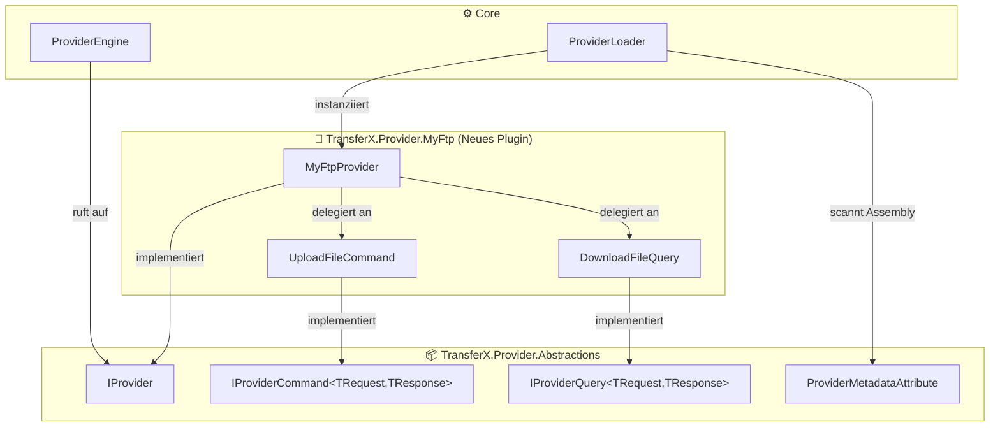
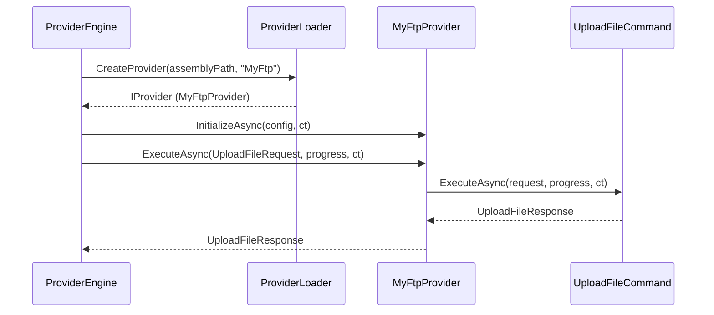
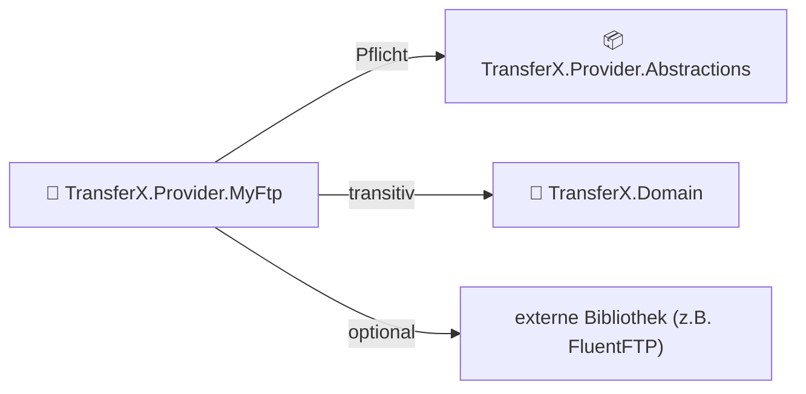
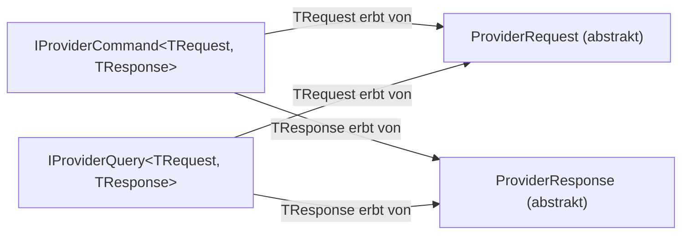
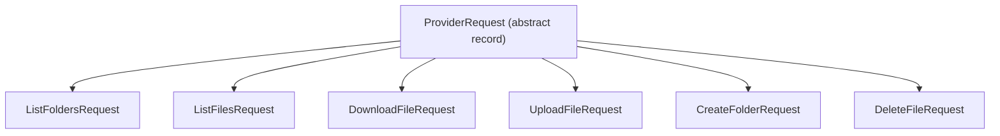
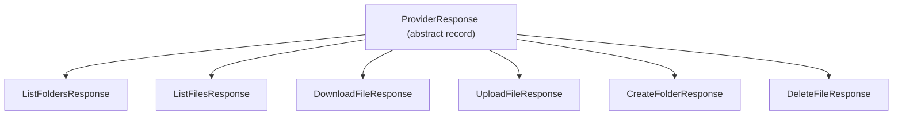
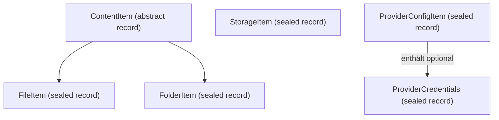
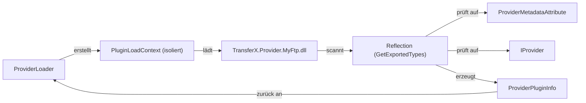

<!-- Migriert aus TransferX\Source\TransferX\docs, Stand: 2026-06-26 -->

# Provider Plugin implementieren

Basis Dokumente: [README](../../README.md), [TransferX Architektur](../architecture/architecture.md), [TransferX Abstractions](../architecture/abstractions.md), [TransferX Core (nicht im DevKit)](../../README.md)

Dieser Leitfaden erklärt Schritt für Schritt, wie ein neues **Provider-Plugin** für TransferX erstellt wird.  
Ein Provider kapselt den Zugriff auf ein Dateisystem oder einen Datendienst (z.B. WebDAV, FTP, lokales Dateisystem, SFTP, S3).

## Inhaltsverzeichnis

1. [Überblick und Architektur](#1-überblick-und-architektur)
2. [Voraussetzungen und Abhängigkeiten](#2-voraussetzungen-und-abhängigkeiten)
3. [Projektstruktur](#3-projektstruktur)
4. [Schritt-für-Schritt-Anleitung](#4-schritt-für-schritt-anleitung)
   - [4.1 Projekt erstellen](#41-projekt-erstellen)
   - [4.2 ProviderMetadataAttribute setzen](#42-providermetadataattribute-setzen)
   - [4.3 IProvider implementieren](#43-iprovider-implementieren)
   - [4.4 Commands und Queries implementieren](#44-commands-und-queries-implementieren)
   - [4.5 ExecuteAsync – Request-Dispatch](#45-executeasync--request-dispatch)
   - [4.6 Fortschritts-Tracking (IProgress)](#46-fortschritts-tracking-iprogress)
5. [Requests & Responses Referenz](#5-requests--responses-referenz)
6. [Models Referenz](#6-models-referenz)
7. [ProviderResult und Fehlerbehandlung](#7-providerresult-und-fehlerbehandlung)
8. [Plugin-Discovery durch den ProviderLoader](#8-plugin-discovery-durch-den-providerloader)
9. [Vollständiges Beispiel: MyFtpProvider](#9-vollständiges-beispiel-myftp-provider)
10. [Checkliste](#10-checkliste)

## 1. Überblick und Architektur

Provider-Plugins sind eigenständige .NET-Assemblies (`.dll`), die vom `ProviderLoader` im Core Layer dynamisch geladen werden.  
Ein Plugin implementiert das `IProvider`-Interface aus `TransferX.Provider.Abstractions` und wird über das `[ProviderMetadata]`-Attribut für die automatische Discovery markiert.



### Ablauf: Provider Aufruf




## 2. Voraussetzungen und Abhängigkeiten

Das neue Plugin-Projekt benötigt ausschliesslich eine Referenz auf `TransferX.Provider.Abstractions`.  
**Keine** Referenz auf Core, Application, Infrastructure oder Domain ist erlaubt oder nötig.    

Die `TransferX.Provider.Abstractions` und `TransferX.Provider.Domain` gibt es als `NuGet` Package.



**`.csproj` Minimal-Konfiguration:**   
Beispiel: TransferX.Provider.MyFtp\TransferX.Provider.MyFtp.csproj

```xml
<Project Sdk="Microsoft.NET.Sdk">

  <PropertyGroup>
    <TargetFramework>net8.0</TargetFramework>
    <Nullable>enable</Nullable>
    <ImplicitUsings>enable</ImplicitUsings>
    <AssemblyName>TransferX.Provider.MyFtp</AssemblyName>
    <RootNamespace>TransferX.Provider.MyFtp</RootNamespace>
  </PropertyGroup>

  <ItemGroup>
    <PackageReference Include="TransferX.Provider.Abstractions" Version="2.0.0" />
  </ItemGroup>

</Project>
```


## 3. Projektstruktur

Empfohlene Ordnerstruktur für ein neues Provider-Plugin:

```tex
TransferX.Provider.MyFtp
│   MyFtpProvider.cs               ← IProvider Implementierung (Haupt-Einstiegspunkt)
│   TransferX.Provider.MyFtp.csproj
│
├───Commands
│       CreateFolderCommand.cs     ← IProviderCommand (Ordner erstellen)
│       DeleteFileCommand.cs       ← IProviderCommand (Datei löschen)
│       UploadFileCommand.cs       ← IProviderCommand (Datei hochladen)
│
└───Queries
        DownloadFileQuery.cs       ← IProviderQuery  (Datei herunterladen)
        ListFilesQuery.cs          ← IProviderQuery  (Dateien auflisten)
        ListFoldersQuery.cs        ← IProviderQuery  (Ordner auflisten)
```


## 4. Schritt-für-Schritt-Anleitung

### 4.1 Projekt erstellen

1. Neues **Class Library (.NET 8)** Projekt erstellen: `TransferX.Provider.MyFtp`
2. Referenz auf `TransferX.Provider.Abstractions` hinzufügen (siehe [Abschnitt 2](#2-voraussetzungen-und-abhängigkeiten))

### 4.2 ProviderMetadataAttribute setzen

Das `[ProviderMetadata]`-Attribut markiert die Klasse für die automatische Plugin-Discovery durch den `ProviderLoader`.  
**Ohne dieses Attribut wird das Plugin nicht gefunden und nicht geladen.**

```c#
TransferX.Provider.MyFtp\MyFtpProvider.cs
// SOWI Informatik, www.sowi.ch
// Franz Schönbächler

using TransferX.Domain.ValueObjects.Progress;
using TransferX.Provider.Abstractions;
using TransferX.Provider.Abstractions.Contracts;
using TransferX.Provider.Abstractions.Metadata;
using TransferX.Provider.Abstractions.Models;
using TransferX.Provider.Abstractions.Requests;
using TransferX.Provider.MyFtp.Commands;
using TransferX.Provider.MyFtp.Queries;

namespace TransferX.Provider.MyFtp;

/// <summary>
/// FTP-Provider-Implementierung für TransferX.<br/>
/// Unterstützt die Standard-Provider-Operationen: Auflisten, Hoch- und Herunterladen, Ordner verwalten, Löschen.
/// </summary>
[ProviderMetadata]
public sealed class MyFtpProvider : IProvider
{
    // ...
}
```

### 4.3 IProvider implementieren

`IProvider` schreibt drei Properties und zwei Methoden vor:

| Member | Pflicht | Beschreibung |
|---|---|---|
| `string Name` | ✅ | Anzeigename, z.B. `"My FTP Provider"` |
| `string Version` | ✅ | Versionsnummer, z.B. `"1.0.0"` |
| `string ProviderType` | ✅ | Technischer Bezeichner, z.B. `"MyFtp"` – muss eindeutig sein |
| `InitializeAsync(config, ct)` | ✅ | Verbindung herstellen, Credentials einlesen |
| `ExecuteAsync(request, progress, ct)` | ✅ | Request entgegennehmen und an Command/Query delegieren |

> **Wichtig:** `ProviderType` muss systemweit eindeutig sein. Der `ProviderLoader` sucht anhand dieses Strings das richtige Plugin.

> **Konstruktor:** Die Provider-Klasse benötigt einen **explizit parameterlosen Konstruktor** für die
> Plugin-Discovery. Primary Constructors mit optionalen Parametern reichen nicht aus – siehe
> [Abschnitt 8](#8-plugin-discovery-durch-den-providerloader).

### 4.4 Commands und Queries implementieren

Operations nach dem **CQS-Muster** (Command/Query Separation):

| Typ | Interface | Ändert Zustand? | Beispiele |
|---|---|---|---|
| **Command** | `IProviderCommand<TRequest, TResponse>` | ✅ Ja | Upload, Ordner erstellen, Löschen |
| **Query** | `IProviderQuery<TRequest, TResponse>` | ❌ Nein | Download, Ordner auflisten, Dateien auflisten |



**Beispiel – Upload Command:**

```c#
TransferX.Provider.MyFtp\Commands\UploadFileCommand.cs
// SOWI Informatik, www.sowi.ch
// Franz Schönbächler

using TransferX.Domain.ValueObjects.Progress;
using TransferX.Provider.Abstractions;
using TransferX.Provider.Abstractions.Requests;
using TransferX.Provider.Abstractions.Responses;

namespace TransferX.Provider.MyFtp.Commands;

/// <summary>
/// Lädt eine Datei per FTP zum Provider hoch.
/// </summary>
internal sealed class UploadFileCommand : IProviderCommand<UploadFileRequest, UploadFileResponse>
{
    private readonly string _basePath;

    /// <summary>Erstellt eine neue Instanz von <see cref="UploadFileCommand"/>.</summary>
    /// <param name="basePath">Basis-URL oder Pfad des FTP-Servers.</param>
    public UploadFileCommand(string basePath)
    {
        this._basePath = basePath;
    }
    
    /// <inheritdoc/>
    public async Task<UploadFileResponse> ExecuteAsync(
        UploadFileRequest request,
        IProgress<FileProgress>? progress = null,
        CancellationToken cancellationToken = default)
    {
        // FTP-spezifische Upload-Logik hier implementieren
        await using var stream = await request.ContentFactory(cancellationToken);
    
        // ... Datei hochladen, Fortschritt melden ...
    
        return new UploadFileResponse
        {
            Success = true,
            Path = request.TargetPath,
            BytesTransferred = request.FileSize
        };
    }
}
```

**Beispiel – List Files Query:**

```c#
TransferX.Provider.MyFtp\Queries\ListFilesQuery.cs
// SOWI Informatik, www.sowi.ch
// Franz Schönbächler

using TransferX.Domain.ValueObjects.Progress;
using TransferX.Provider.Abstractions;
using TransferX.Provider.Abstractions.Models;
using TransferX.Provider.Abstractions.Requests;
using TransferX.Provider.Abstractions.Responses;

namespace TransferX.Provider.MyFtp.Queries;

/// <summary>
/// Listet Dateien in einem FTP-Verzeichnis auf.
/// </summary>
internal sealed class ListFilesQuery : IProviderQuery<ListFilesRequest, ListFilesResponse>
{
    private readonly string _basePath;

    /// <summary>Erstellt eine neue Instanz von <see cref="ListFilesQuery"/>.</summary>
    /// <param name="basePath">Basis-URL oder Pfad des FTP-Servers.</param>
    public ListFilesQuery(string basePath)
    {
        this._basePath = basePath;
    }
    
    /// <inheritdoc/>
    public async Task<ListFilesResponse> ExecuteAsync(
        ListFilesRequest request,
        IProgress<FileProgress>? progress = null,
        CancellationToken cancellationToken = default)
    {
        // FTP-spezifische Logik zum Auflisten von Dateien hier implementieren
        var items = new List<FileItem>();
    
        // ... FTP-Verzeichnis lesen, items befüllen ...
    
        return new ListFilesResponse
        {
            Items = items,
            SearchedPath = request.Path,
            WasRecursive = request.Recursive
        };
    }
}
```

### 4.5 ExecuteAsync – Request-Dispatch

`IProvider.ExecuteAsync` empfängt **alle** Requests als `ProviderRequest`-Basistyp.  
Die Implementierung **muss** via Pattern-Matching auf den konkreten Typ prüfen und an das zuständige Command oder Query delegieren.

> **Nicht unterstützte Request-Typen** sollen eine `NotSupportedException` werfen, damit der Aufrufer klar informiert wird.

```c#
/// <inheritdoc/>
public async Task<ProviderResponse> ExecuteAsync(
    ProviderRequest request,
    IProgress<FileProgress>? progress = null,
    CancellationToken cancellationToken = default)
{
    return request switch
    {
        ListFoldersRequest listFolders =>
            await new ListFoldersQuery(this._basePath)
                .ExecuteAsync(listFolders, progress, cancellationToken),

        ListFilesRequest listFiles =>
            await new ListFilesQuery(this._basePath)
                .ExecuteAsync(listFiles, progress, cancellationToken),
    
        DownloadFileRequest download =>
            await new DownloadFileQuery(this._basePath)
                .ExecuteAsync(download, progress, cancellationToken),
    
        UploadFileRequest upload =>
            await new UploadFileCommand(this._basePath)
                .ExecuteAsync(upload, progress, cancellationToken),
    
        CreateFolderRequest createFolder =>
            await new CreateFolderCommand(this._basePath)
                .ExecuteAsync(createFolder, progress, cancellationToken),
    
        DeleteFileRequest deleteFile =>
            await new DeleteFileCommand(this._basePath)
                .ExecuteAsync(deleteFile, progress, cancellationToken),
    
        _ => throw new NotSupportedException(
            $"Request-Typ '{request.GetType().Name}' wird von {this.ProviderType} nicht unterstützt.")
    };
}
```

### 4.6 Fortschritts-Tracking (IProgress)

`IProgress<FileProgress>` wird bei Operationen mit Datenübertragung genutzt (Upload, Download).  
Der `progress`-Parameter kann `null` sein – immer prüfen vor dem Aufruf.

| Property | Typ | Beschreibung |
|---|---|---|
| `TransferId` | `Guid` | ID des zugehörigen Transfers (wird vom Core gesetzt) |
| `FileName` | `string` | Name der aktuellen Datei (ohne Pfad) |
| `FilePath` | `string` | Vollständiger Pfad der Datei |
| `TransferredBytes` | `long` | Bereits übertragene Bytes |
| `TotalBytes` | `long` | Gesamtgrösse der Datei in Bytes |
| `Status` | `TransferStatus` | Aktueller Übertragungsstatus |
| `StartedAt` | `DateTime` | Startzeitpunkt der Übertragung (UTC) |
| `ProgressPercent` | `double` | Fortschritt in Prozent (0–100) |

> **Hinweis für Plugin-Entwickler:** `TransferId`, `Status` und `StartedAt` werden in der Regel vom Core Layer befüllt. Im Plugin typischerweise nur `FileName`, `FilePath`, `TotalBytes` und `TransferredBytes` setzen.

**Fortschritt im Upload melden:**

```c#
// Fortschritt periodisch melden (z.B. bei jedem übertragenen Chunk)
progress?.Report(new FileProgress
{
    FileName = Path.GetFileName(request.TargetPath),
    FilePath = request.TargetPath,
    TransferredBytes = bytesTransferred,
    TotalBytes = request.FileSize
});
```


## 5. Requests & Responses Referenz

Alle Requests erben von `ProviderRequest`, alle Responses von `ProviderResponse`.





### Request/Response Übersicht

| Request | Response | CQS-Typ | Beschreibung |
|---|---|---|---|
| `ListFoldersRequest` | `ListFoldersResponse` | Query | Ordner unter einem Pfad auflisten |
| `ListFilesRequest` | `ListFilesResponse` | Query | Dateien unter einem Pfad auflisten |
| `DownloadFileRequest` | `DownloadFileResponse` | Query | Datei herunterladen |
| `UploadFileRequest` | `UploadFileResponse` | Command | Datei hochladen |
| `CreateFolderRequest` | `CreateFolderResponse` | Command | Ordner erstellen |
| `DeleteFileRequest` | `DeleteFileResponse` | Command | Datei löschen |

### Request-Properties im Detail

**`ListFoldersRequest`**

| Property | Typ | Default | Beschreibung |
|---|---|---|---|
| `Path` | `string` | – | Pfad, dessen Unterordner aufgelistet werden |
| `Recursive` | `bool` | `false` | Rekursive Auflistung aller Unterebenen |

**`ListFilesRequest`**

| Property | Typ | Default | Beschreibung |
|---|---|---|---|
| `Path` | `string` | – | Pfad, dessen Dateien aufgelistet werden |
| `Recursive` | `bool` | `false` | Rekursive Auflistung aller Unterebenen |

**`DownloadFileRequest`**

| Property | Typ | Beschreibung |
|---|---|---|
| `Path` | `string` | Vollständiger Pfad der herunterzuladenden Datei |

**`UploadFileRequest`**

| Property | Typ | Beschreibung |
|---|---|---|
| `TargetPath` | `string` | Zielpfad inkl. Dateiname beim Provider |
| `ContentFactory` | `Func<CancellationToken, Task<Stream>>` | Factory für den Upload-Stream (Retry-fähig) |
| `FileSize` | `long` | Dateigrösse in Bytes (für Fortschritts-Tracking) |
| `ContentType` | `string?` | Optionaler MIME-Typ, z.B. `"application/pdf"` |

> **Hinweis `ContentFactory`:** Den Stream **immer** über die Factory-Funktion beziehen – nicht einmalig speichern. Bei Retries wird die Factory erneut aufgerufen, um einen frischen Stream zu erhalten.

**`CreateFolderRequest`**

| Property | Typ | Default | Beschreibung |
|---|---|---|---|
| `Path` | `string` | – | Vollständiger Pfad des zu erstellenden Ordners |
| `CreateParentFolders` | `bool` | `false` | Fehlende Elternordner automatisch erstellen |
| `IgnoreIfExists` | `bool` | `true` | Kein Fehler wenn Ordner bereits existiert |

**`DeleteFileRequest`**

| Property | Typ | Default | Beschreibung |
|---|---|---|---|
| `Path` | `string` | – | Vollständiger Pfad der zu löschenden Datei |
| `IgnoreIfNotExists` | `bool` | `true` | Kein Fehler wenn Datei nicht gefunden |

### Response-Properties im Detail

**`ListFoldersResponse`**

| Property | Typ | Beschreibung |
|---|---|---|
| `Items` | `IReadOnlyList<FolderItem>` | Liste der gefundenen Ordner |
| `SearchedPath` | `string` | Abgefragter Pfad |
| `TotalFolders` | `int` | Anzahl gefundener Ordner (berechnet) |
| `WasRecursive` | `bool` | Gibt an, ob rekursiv abgefragt wurde |

**`ListFilesResponse`**

| Property | Typ | Beschreibung |
|---|---|---|
| `Items` | `IReadOnlyList<FileItem>` | Liste der gefundenen Dateien |
| `SearchedPath` | `string` | Abgefragter Pfad |
| `TotalFiles` | `int` | Anzahl gefundener Dateien (berechnet) |
| `TotalSizeBytes` | `long` | Gesamtgrösse aller Dateien (berechnet) |
| `WasRecursive` | `bool` | Gibt an, ob rekursiv abgefragt wurde |

**`DownloadFileResponse`**

| Property | Typ | Beschreibung |
|---|---|---|
| `Stream` | `Stream` | Datei-Stream – **der Aufrufer ist für das Schliessen verantwortlich** |
| `FileSize` | `long` | Dateigrösse in Bytes |
| `ContentType` | `string?` | MIME-Typ der Datei, `null` wenn nicht verfügbar |

**`UploadFileResponse`**

| Property | Typ | Beschreibung |
|---|---|---|
| `Success` | `bool` | Upload erfolgreich |
| `Path` | `string` | Vollständiger Pfad beim Provider |
| `BytesTransferred` | `long` | Tatsächlich übertragene Bytes |

**`CreateFolderResponse`**

| Property | Typ | Beschreibung |
|---|---|---|
| `Success` | `bool` | Operation erfolgreich |
| `Path` | `string` | Vollständiger Pfad des Ordners |
| `WasCreated` | `bool` | `true` = neu erstellt, `false` = bereits vorhanden |
| `ParentFoldersCreated` | `int` | Anzahl automatisch erstellter Elternordner |

**`DeleteFileResponse`**

| Property | Typ | Beschreibung |
|---|---|---|
| `Success` | `bool` | Operation erfolgreich |
| `Path` | `string` | Vollständiger Pfad der betroffenen Datei |
| `WasDeleted` | `bool` | `true` = tatsächlich gelöscht |
| `WasNotFound` | `bool` | `true` = Datei war nicht vorhanden |


## 6. Models Referenz



### `ContentItem` – Basisklasse für Dateisystem-Einträge

| Property | Typ | Beschreibung |
|---|---|---|
| `Name` | `string` | Name des Eintrags (ohne Pfad) |
| `Path` | `string` | Vollständiger Pfad beim Provider |
| `LastModified` | `DateTime?` | Letzte Änderung (UTC), `null` wenn Provider keine Zeitinfo liefert |

### `FileItem` – Datei

| Property | Typ | Beschreibung |
|---|---|---|
| `Size` | `long` | Dateigrösse in Bytes |
| `ContentType` | `string?` | MIME-Typ, `null` wenn nicht bekannt |

### `FolderItem` – Ordner

| Property | Typ | Beschreibung |
|---|---|---|
| `HasChildren` | `bool` | Gibt an, ob Unterordner vorhanden sind |

### `StorageItem` – Speicherinformationen

| Property | Typ | Beschreibung |
|---|---|---|
| `TotalBytes` | `long` | Gesamtkapazität in Bytes |
| `FreeBytes` | `long` | Freier Speicher in Bytes |
| `UsedBytes` | `long` | Verwendeter Speicher (berechnet: `Total - Free`) |

### `ProviderConfigItem` – Konfiguration

Wird in `InitializeAsync` übergeben. Enthält alle nötigen Verbindungsparameter.

| Property | Typ | Beschreibung |
|---|---|---|
| `Id` | `Guid` | Eindeutige ID der Konfiguration |
| `Name` | `string` | Anzeigename |
| `ProviderType` | `string` | Technischer Typ, z.B. `"MyFtp"` |
| `BasePath` | `string` | Basis-URL oder Pfad, z.B. `"ftp://meinserver.ch"` |
| `Credentials` | `ProviderCredentials?` | Zugangsdaten, `null` wenn keine Authentifizierung |

### `ProviderCredentials` – Zugangsdaten

| Property | Typ | Beschreibung |
|---|---|---|
| `Username` | `string` | Benutzername |
| `Password` | `string` | Passwort (in `ToString()` maskiert als `Username:***`) |


## 7. ProviderResult und Fehlerbehandlung

`ProviderResult` (Namespace `TransferX.Provider.Abstractions.Contracts`) kapselt den Erfolg oder Misserfolg einer Operation. Factory-Methoden vereinfachen die Erstellung:

```c#
// Erfolgreich
var ok = ProviderResult.Ok();

// Fehler mit Meldung
var fail = ProviderResult.Fail("Verbindung zum FTP-Server fehlgeschlagen.");

// Fehler mit Ausnahme
var failEx = ProviderResult.Fail("Verbindung fehlgeschlagen.", exception);
```

### Empfohlene Fehlerbehandlung in Commands/Queries

- **Bekannte Fehler** (z.B. Datei nicht gefunden, Verbindungsfehler): `ProviderResult.Fail(...)` verwenden, keine Exception werfen.
- **Unbekannte Fehler / Programmierfehler**: Exception propagieren lassen.
- **Abbruch**: `CancellationToken` prüfen und `OperationCanceledException` propagieren lassen.
- **Nicht unterstützte Requests**: `NotSupportedException` werfen.

```c#
public async Task<UploadFileResponse> ExecuteAsync(
    UploadFileRequest request,
    IProgress<FileProgress>? progress = null,
    CancellationToken cancellationToken = default)
{
    try
    {
        cancellationToken.ThrowIfCancellationRequested();

        // ... Upload-Logik ...
    
        return new UploadFileResponse { Success = true, Path = request.TargetPath, BytesTransferred = request.FileSize };
    }
    catch (OperationCanceledException)
    {
        throw; // Abbruch propagieren
    }
    catch (Exception ex)
    {
        // Fehler als Response zurückgeben (kein unbehandelter Crash)
        return new UploadFileResponse { Success = false, Path = request.TargetPath, BytesTransferred = 0 };
        // Alternativ: Exception für den Core loggen lassen
    }
}
```


## 8. Plugin-Discovery durch den ProviderLoader

Der `ProviderLoader` im Core Layer scannt Plugin-Assemblies automatisch nach Klassen, die:

1. Das `[ProviderMetadata]`-Attribut tragen
2. `IProvider` implementieren
3. Einen parameterlosen Konstruktor besitzen (Instanziierung via `Activator.CreateInstance`)

> **Wichtig – Primary Constructors (C# 12):** Ein Primary Constructor mit optionalem Parameter erzeugt
> **keinen** parameterlosen Konstruktor für Reflection. `new MyProvider()` kompiliert zwar (der Compiler
> setzt Defaultwerte), `Activator.CreateInstance(typeof(MyProvider))` schlägt jedoch mit
> `MissingMethodException: No parameterless constructor defined` fehl und das Plugin wird übersprungen.

**Falsch** (funktioniert im Unit-Test, nicht im Host):

```c#
[ProviderMetadata]
public sealed class MyProvider(ILoggerFactory? loggerFactory = null) : IProvider
{
    // ...
}
```

**Richtig** (parameterloser Konstruktor für den `ProviderLoader`, optionaler Zusatzkonstruktor für Tests):

```c#
[ProviderMetadata]
public sealed class MyProvider : IProvider
{
    private readonly ILoggerFactory? _loggerFactory;

    public MyProvider()
        : this(null)
    {
    }

    public MyProvider(ILoggerFactory? loggerFactory)
    {
        this._loggerFactory = loggerFactory;
    }

    // ...
}
```

> Dependencies vom Host (z.B. `ILoggerFactory`) werden **nicht** über den Konstruktor injiziert.
> Konfiguration und Initialisierung erfolgen ausschliesslich über `InitializeAsync`.



### Deployment

Die fertig kompilierte Plugin-Assembly (`.dll`) inkl. aller transitiven Abhängigkeiten muss im Plugin-Verzeichnis des Hosts abgelegt werden:

```tex
./plugins/providers/
    TransferX.Provider.MyFtp.dll
    FluentFTP.dll                  ← transitive Abhängigkeiten des Plugins
    ...
```

### Shared Assemblies (TransferX.*.dll)

Der Host stellt `TransferX.Provider.Abstractions.dll` und `TransferX.Domain.dll` über den `PluginLoadContext` bereit und teilt diese mit allen Plugins.

In der Praxis kopiert `dotnet publish` oder ein Build-Skript diese DLLs oft **mit** ins Plugin-Verzeichnis. Das ist unkritisch: `DiscoverAll` scannt zwar alle `*.dll`, erkennt in Shared-Assemblies aber keinen gültigen Provider und überspringt sie still. Es ist **kein** Dateinamen-Filter nötig.

| Situation | Verhalten |
|---|---|
| Nur die Plugin-Assembly deployt | Empfohlen – weniger Dateien im Verzeichnis |
| Shared-DLLs liegen zusätzlich im Ordner | Unkritisch – werden beim Discovery-Lauf übersprungen |
| Third-Party-Plugin mit eigenem Namen | Wird über `[ProviderMetadata]` + `IProvider` erkannt |


## 9. Vollständiges Beispiel: MyFtp Provider

Das folgende Beispiel zeigt eine vollständige, minimale `IProvider`-Implementierung.

```c#
TransferX.Provider.MyFtp\MyFtpProvider.cs
// SOWI Informatik, www.sowi.ch
// Franz Schönbächler

using TransferX.Domain.ValueObjects.Progress;
using TransferX.Provider.Abstractions;
using TransferX.Provider.Abstractions.Contracts;
using TransferX.Provider.Abstractions.Metadata;
using TransferX.Provider.Abstractions.Models;
using TransferX.Provider.Abstractions.Requests;
using TransferX.Provider.MyFtp.Commands;
using TransferX.Provider.MyFtp.Queries;

namespace TransferX.Provider.MyFtp;

/// <summary>
/// FTP-Provider-Implementierung für TransferX.<br/>
/// Unterstützt: Auflisten von Ordnern und Dateien, Hoch- und Herunterladen,<br/>
/// Erstellen und Löschen von Ordnern und Dateien.
/// </summary>
[ProviderMetadata]
public sealed class MyFtpProvider : IProvider
{
    private string _basePath = string.Empty;
    private ProviderCredentials? _credentials;

    /// <inheritdoc/>
    public string Name => "My FTP Provider";
    
    /// <inheritdoc/>
    public string Version => "1.0.0";
    
    /// <inheritdoc/>
    public string ProviderType => "MyFtp";
    
    /// <inheritdoc/>
    public Task InitializeAsync(ProviderConfigItem config, CancellationToken cancellationToken = default)
    {
        this._basePath = config.BasePath;
        this._credentials = config.Credentials;
    
        // Verbindungsaufbau / Validierung hier implementieren
        return Task.CompletedTask;
    }
    
    /// <inheritdoc/>
    public async Task<ProviderResponse> ExecuteAsync(
        ProviderRequest request,
        IProgress<FileProgress>? progress = null,
        CancellationToken cancellationToken = default)
    {
        return request switch
        {
            ListFoldersRequest listFolders =>
                await new ListFoldersQuery(this._basePath, this._credentials)
                    .ExecuteAsync(listFolders, progress, cancellationToken),
    
            ListFilesRequest listFiles =>
                await new ListFilesQuery(this._basePath, this._credentials)
                    .ExecuteAsync(listFiles, progress, cancellationToken),
    
            DownloadFileRequest download =>
                await new DownloadFileQuery(this._basePath, this._credentials)
                    .ExecuteAsync(download, progress, cancellationToken),
    
            UploadFileRequest upload =>
                await new UploadFileCommand(this._basePath, this._credentials)
                    .ExecuteAsync(upload, progress, cancellationToken),
    
            CreateFolderRequest createFolder =>
                await new CreateFolderCommand(this._basePath, this._credentials)
                    .ExecuteAsync(createFolder, progress, cancellationToken),
    
            DeleteFileRequest deleteFile =>
                await new DeleteFileCommand(this._basePath, this._credentials)
                    .ExecuteAsync(deleteFile, progress, cancellationToken),
    
            _ => throw new NotSupportedException(
                $"Request-Typ '{request.GetType().Name}' wird von {this.ProviderType} nicht unterstützt.")
        };
    }
}
```


## 10. Checkliste

Vor dem Deployment des neuen Providers alle Punkte prüfen:

| # | Aufgabe | Erledigt |
|---|---|---|
| 1 | `[ProviderMetadata]`-Attribut an der Provider-Klasse gesetzt | ☐ |
| 2 | Explizit parameterloser Konstruktor vorhanden (kein Primary Constructor mit optionalen Parametern) | ☐ |
| 3 | `IProvider` vollständig implementiert (`Name`, `Version`, `ProviderType`, `InitializeAsync`, `ExecuteAsync`) | ☐ |
| 4 | `ProviderType` ist systemweit eindeutig (z.B. `"MyFtp"`, `"MySftp"`) | ☐ |
| 5 | Alle 6 Standard-Operationen im `ExecuteAsync`-Switch behandelt | ☐ |
| 6 | `default`-Fall im Switch wirft `NotSupportedException` | ☐ |
| 7 | `IProgress<FileProgress>` wird bei Upload und Download korrekt gemeldet | ☐ |
| 8 | `progress`-Parameter wird vor dem Aufruf auf `null` geprüft (`progress?.Report(...)`) | ☐ |
| 9 | `CancellationToken` wird in allen asynchronen Methoden weitergereicht | ☐ |
| 10 | `UploadFileRequest.ContentFactory` wird bei jedem Versuch neu aufgerufen (Retry-Unterstützung) | ☐ |
| 11 | `DownloadFileResponse.Stream` wird korrekt zurückgegeben (Aufrufer schliesst den Stream) | ☐ |
| 12 | `ProviderCredentials` werden sicher behandelt (kein Logging des Passworts) | ☐ |
| 13 | Datei-Header in jeder `.cs`-Datei vorhanden | ☐ |
| 14 | XML-Kommentare (`///`) für alle `public` Members vorhanden | ☐ |
| 15 | Plugin-Assembly inkl. eigener Abhängigkeiten im Plugin-Verzeichnis deployt | ☐ |
| 16 | Shared-DLLs (`TransferX.Provider.Abstractions`, `TransferX.Domain`) vom Host geteilt; Mitlieferung beim Publish ist unkritisch | ☐ |

