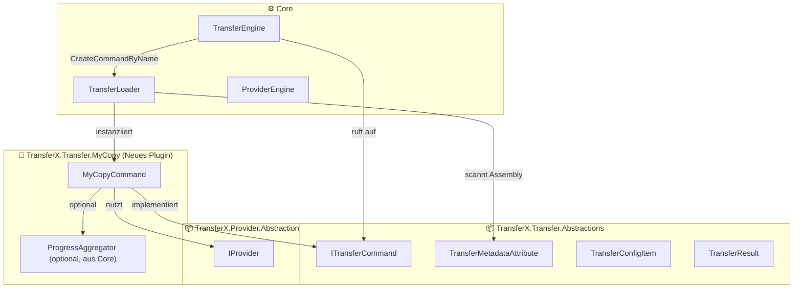
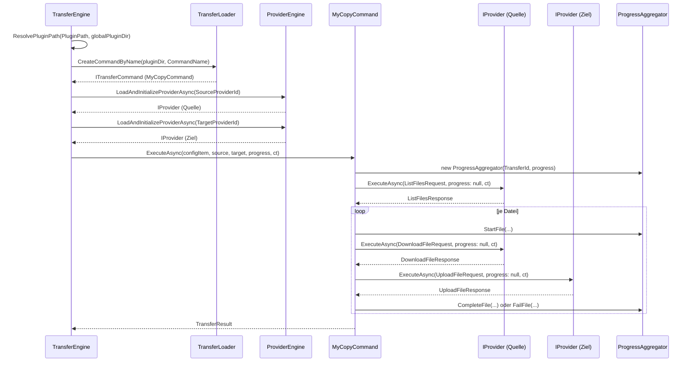
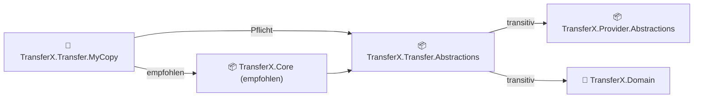
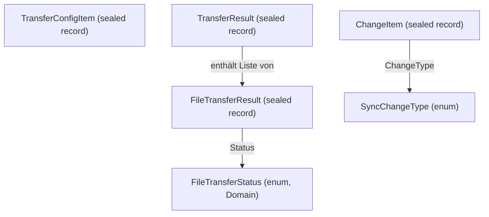
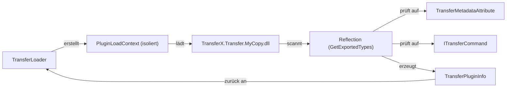

<!-- Migriert aus TransferX\Source\TransferX\docs, Stand: 2026-06-26 -->

# Transfer Plugin implementieren

> **plugin-devkit:** Templates in [templates/transfer-template/](../../templates/transfer-template/) enthalten **keine** `TransferX.Core`-Referenz.
> `TransferX.Core` (z.B. `ProgressAggregator`) ist optional und wird in produktiven Plugins wie Copy verwendet — für Scaffold-Plugins nicht erforderlich.

Basis Dokumente: [README](../../README.md), [TransferX Architektur](../architecture/architecture.md), [TransferX Abstractions](../architecture/abstractions.md), [TransferX Core (nicht im DevKit)](../../README.md)

Dieser Leitfaden erklärt Schritt für Schritt, wie ein neues **Transfer-Plugin** für TransferX erstellt wird.  
Ein Transfer-Plugin kapselt die Logik für einen spezifischen Transfertyp (z.B. Copy, Sync, Preview) und arbeitet mit zwei Provider-Instanzen (Quelle und Ziel).

## Inhaltsverzeichnis

1. [Überblick und Architektur](#1-überblick-und-architektur)
2. [Voraussetzungen und Abhängigkeiten](#2-voraussetzungen-und-abhängigkeiten)
3. [Projektstruktur](#3-projektstruktur)
4. [Schritt-für-Schritt-Anleitung](#4-schritt-für-schritt-anleitung)
   - [4.1 Projekt erstellen](#41-projekt-erstellen)
   - [4.2 TransferMetadataAttribute setzen](#42-transfermetadataattribute-setzen)
   - [4.3 ITransferCommand implementieren](#43-itransfercommand-implementieren)
   - [4.4 Fortschritts-Tracking (IProgress)](#44-fortschritts-tracking-iprogress)
   - [4.5 Fehlerbehandlung und TransferResult](#45-fehlerbehandlung-und-transferresult)
5. [Modelle Referenz](#5-modelle-referenz)
6. [Plugin-Discovery durch den TransferLoader](#6-plugin-discovery-durch-den-transferloader)
7. [Vollständiges Beispiel: MyCopyCommand](#7-vollständiges-beispiel-mycopycommand)
8. [Checkliste](#8-checkliste)

## 1. Überblick und Architektur

Transfer-Plugins sind eigenständige .NET-Assemblies (`.dll`), die vom `TransferLoader` im Core Layer dynamisch geladen werden.  
Ein Plugin implementiert das `ITransferCommand`-Interface aus `TransferX.Transfer.Abstractions` und wird über das `[TransferMetadata]`-Attribut für die automatische Discovery markiert.

> **Wichtig:** Pro Assembly wird genau **ein** Transfer-Command erwartet. Ein Plugin = ein Command.

Die `TransferEngine` lädt den Command anhand von `config.CommandName` aus einem **Plugin-Verzeichnis** (nicht aus einem einzelnen Assembly-Pfad).  
Optional kann pro Transfer-Konfiguration ein eigener `PluginPath` gesetzt werden (siehe [Abschnitt 6](#6-plugin-discovery-durch-den-transferloader)).



### Ablauf: Transfer-Plugin Aufruf




## 2. Voraussetzungen und Abhängigkeiten

Das Plugin-Projekt benötigt mindestens eine Referenz auf `TransferX.Transfer.Abstractions`.  
Für strukturiertes Fortschritts-Tracking wird zusätzlich **`TransferX.Core`** empfohlen (`ProgressAggregator`).

**Keine** Referenz auf Application, Infrastructure oder Domain als direkte Projektreferenz ist nötig – `TransferX.Domain` und `TransferX.Provider.Abstractions` kommen transitiv über `TransferX.Transfer.Abstractions`.

Die Pakete `TransferX.Transfer.Abstractions`, `TransferX.Provider.Abstractions` und `TransferX.Core` gibt es als NuGet-Packages.



**`.csproj` Minimal-Konfiguration:**  
Beispiel: TransferX.Transfer.MyCopy\TransferX.Transfer.MyCopy.csproj

```xml
<Project Sdk="Microsoft.NET.Sdk">

  <PropertyGroup>
    <TargetFramework>net8.0</TargetFramework>
    <Nullable>enable</Nullable>
    <ImplicitUsings>enable</ImplicitUsings>
    <AssemblyName>TransferX.Transfer.MyCopy</AssemblyName>
    <RootNamespace>TransferX.Transfer.MyCopy</RootNamespace>
  </PropertyGroup>

  <ItemGroup>
    <PackageReference Include="TransferX.Transfer.Abstractions" Version="2.0.0" />
    <!-- Empfohlen: Fortschritt über ProgressAggregator -->
    <PackageReference Include="TransferX.Core" Version="2.0.0" />
  </ItemGroup>

</Project>
```


## 3. Projektstruktur

Empfohlene Ordnerstruktur für ein neues Transfer-Plugin:

```tex
TransferX.Transfer.MyCopy
│   MyCopyCommand.cs               ← ITransferCommand Implementierung (Haupt-Einstiegspunkt)
│   TransferX.Transfer.MyCopy.csproj
│
└───Helpers
        ChangeDetector.cs          ← Hilfklasse z.B. für Änderungserkennung (optional)
        PathMapper.cs              ← Hilfklasse für Pfad-Mapping (optional)
```

> **Hinweis:** Da pro Plugin genau ein Command implementiert wird, ist keine Commands/Queries-Unterstruktur wie beim Provider-Plugin nötig. Hilfklassen können in einem `Helpers`-Ordner organisiert werden.


## 4. Schritt-für-Schritt-Anleitung

### 4.1 Projekt erstellen

1. Neues **Class Library (.NET 8)** Projekt erstellen: `TransferX.Transfer.MyCopy`
2. Referenz auf `TransferX.Transfer.Abstractions` hinzufügen (siehe [Abschnitt 2](#2-voraussetzungen-und-abhängigkeiten))
3. Optional: `TransferX.Core` für `ProgressAggregator` hinzufügen

### 4.2 TransferMetadataAttribute setzen

Das `[TransferMetadata]`-Attribut markiert die Klasse für die automatische Plugin-Discovery durch den `TransferLoader`.  
**Ohne dieses Attribut wird das Plugin nicht gefunden und nicht geladen.**

```c#
TransferX.Transfer.MyCopy\MyCopyCommand.cs
// SOWI Informatik, www.sowi.ch
// Franz Schönbächler

using TransferX.Provider.Abstractions;
using TransferX.Transfer.Abstractions;
using TransferX.Transfer.Abstractions.Metadata;
using TransferX.Transfer.Abstractions.Models;

namespace TransferX.Transfer.MyCopy;

/// <summary>
/// Copy-Transfer-Command-Implementierung für TransferX.<br/>
/// Kopiert alle Dateien vom Quell-Provider zum Ziel-Provider.
/// </summary>
[TransferMetadata]
public sealed class MyCopyCommand : ITransferCommand
{
    // ...
}
```

### 4.3 ITransferCommand implementieren

`ITransferCommand` schreibt drei Properties und eine Methode vor:

| Member | Pflicht | Beschreibung |
|---|---|---|
| `string CommandName` | ✅ | Eindeutiger Command-Name, z.B. `"MyCopy"` – muss systemweit eindeutig sein |
| `string Description` | ✅ | Kurzbeschreibung der Funktion, z.B. `"Kopiert alle Dateien von Quelle nach Ziel"` |
| `string Version` | ✅ | Versionsnummer, z.B. `"1.0.0"` |
| `ExecuteAsync(config, source, target, progress, ct)` | ✅ | Transfer-Logik implementieren und `TransferResult` zurückgeben |

> **Wichtig:** `CommandName` muss systemweit eindeutig sein. Der `TransferLoader` sucht anhand dieses Strings das richtige Plugin im Plugin-Verzeichnis.

**Signatur von `ExecuteAsync`:**

```c#
Task<TransferResult> ExecuteAsync(
    TransferConfigItem config,
    IProvider sourceProvider,
    IProvider targetProvider,
    IProgress<ProgressReport>? progress = null,
    CancellationToken cancellationToken = default);
```

| Parameter | Typ | Beschreibung |
|---|---|---|
| `config` | `TransferConfigItem` | Konfiguration des Transfer-Auftrags (Pfade, IDs, CommandName) |
| `sourceProvider` | `IProvider` | Bereits initialisierter Quell-Provider |
| `targetProvider` | `IProvider` | Bereits initialisierter Ziel-Provider |
| `progress` | `IProgress<ProgressReport>?` | Fortschritts-Callback von der `TransferEngine`, kann `null` sein |
| `cancellationToken` | `CancellationToken` | Abbruch-Token für kooperativen Abbruch |

> **Hinweis `IProvider.ExecuteAsync`:** Die Signatur lautet `(ProviderRequest request, IProgress<FileProgress>? progress, CancellationToken cancellationToken)`.  
> Der zweite Parameter ist der Byte-Fortschritt auf Provider-Ebene – bei Listing/Download in Transfer-Commands in der Regel `progress: null` übergeben.

### 4.4 Fortschritts-Tracking (IProgress)

Die `TransferEngine` reicht `IProgress<ProgressReport>?` **unverändert** an den Command weiter – sie erzeugt keinen `ProgressAggregator` selbst.  
Der Command ist dafür verantwortlich, strukturierte `ProgressReport`-Meldungen zu erzeugen.

**Empfohlen:** `ProgressAggregator` aus `TransferX.Core.Services.Progress` verwenden (siehe auch [ProgressAggregator (TransferX Core, nicht im DevKit)](../../README.md)):

```c#
using TransferX.Core.Services.Progress;
using TransferX.Domain.ValueObjects.Progress;

// Zu Beginn von ExecuteAsync:
var aggregator = new ProgressAggregator(config.TransferId, progress);
aggregator.Initialize(totalFiles: listResponse.Items.Count, totalBytes: listResponse.TotalSizeBytes);

foreach (var file in listResponse.Items)
{
    aggregator.StartFile(file.Path, file.Size);

    try
    {
        // Datei übertragen ...
        aggregator.CompleteFile(file.Path, uploadResponse.BytesTransferred);
    }
    catch (Exception)
    {
        aggregator.FailFile(file.Path, "Übertragung fehlgeschlagen.");
        throw; // oder lokal abfangen und mit Failed fortfahren
    }
}
```

`ProgressReport` enthält je nach `ProgressLevel` entweder `Transfer`- oder `File`-Daten (`TransferProgress` / `FileProgress` aus `TransferX.Domain.ValueObjects.Progress`).  
UI-Komponenten (z.B. Console) werten typischerweise Meldungen mit `Level == ProgressLevel.Transfer` aus.

> **Ohne Core-Referenz:** `ProgressReport` manuell mit `Level`, `Transfer` bzw. `File` befüllen – aufwändiger; `TransferX.Core` ist für Plugins mit Fortschrittsanzeige empfohlen.

### 4.5 Fehlerbehandlung und TransferResult

- **Einzeldatei-Fehler**: Pro Datei einen `FileTransferResult` mit dem entsprechenden `FileTransferStatus` erstellen – keinen Abbruch des gesamten Transfers.
- **Globaler Fehler** (z.B. Verbindungsabbruch): `TransferResult` mit `Success = false` und `ErrorMessage` zurückgeben.
- **Abbruch**: `CancellationToken` prüfen und `OperationCanceledException` propagieren lassen.

```c#
using TransferX.Domain.Enumerations;

public async Task<TransferResult> ExecuteAsync(
    TransferConfigItem config,
    IProvider sourceProvider,
    IProvider targetProvider,
    IProgress<ProgressReport>? progress = null,
    CancellationToken cancellationToken = default)
{
    var startTime = DateTime.UtcNow;
    var fileResults = new List<FileTransferResult>();

    try
    {
        cancellationToken.ThrowIfCancellationRequested();
    
        // Dateien auflisten
        var listResponse = (ListFilesResponse)await sourceProvider.ExecuteAsync(
            new ListFilesRequest { Path = config.SourcePath, Recursive = true },
            progress: null,
            cancellationToken);
    
        foreach (var file in listResponse.Items)
        {
            cancellationToken.ThrowIfCancellationRequested();
    
            try
            {
                // Datei herunterladen und hochladen
                // ...
    
                fileResults.Add(new FileTransferResult
                {
                    FileName = file.Name,
                    SourcePath = file.Path,
                    Status = FileTransferStatus.Completed,
                    BytesTransferred = file.Size
                });
            }
            catch (Exception ex)
            {
                fileResults.Add(new FileTransferResult
                {
                    FileName = file.Name,
                    SourcePath = file.Path,
                    Status = FileTransferStatus.Failed,
                    ErrorMessage = ex.Message,
                    BytesTransferred = 0
                });
            }
        }
    
        return new TransferResult
        {
            Success = fileResults.All(r => r.Status == FileTransferStatus.Completed),
            TotalFiles = fileResults.Count,
            SuccessfulFiles = fileResults.Count(r => r.Status == FileTransferStatus.Completed),
            FailedFiles = fileResults.Count(r => r.Status == FileTransferStatus.Failed),
            TotalBytesTransferred = fileResults.Sum(r => r.BytesTransferred),
            Duration = DateTime.UtcNow - startTime,
            FileResults = fileResults.AsReadOnly()
        };
    }
    catch (OperationCanceledException)
    {
        throw; // Abbruch propagieren
    }
    catch (Exception ex)
    {
        return new TransferResult
        {
            Success = false,
            TotalFiles = 0,
            SuccessfulFiles = 0,
            FailedFiles = 0,
            TotalBytesTransferred = 0,
            Duration = DateTime.UtcNow - startTime,
            FileResults = fileResults.AsReadOnly(),
            ErrorMessage = ex.Message
        };
    }
}
```


## 5. Modelle Referenz



### `TransferConfigItem` – Konfiguration des Transfer-Auftrags

Wird in `ExecuteAsync` übergeben. Enthält alle nötigen Konfigurationsparameter für den Command.

| Property | Typ | Beschreibung |
|---|---|---|
| `TransferId` | `Guid` | Eindeutige ID des Transfer-Auftrags |
| `SourceProviderId` | `Guid` | ID des Quell-Providers |
| `SourcePath` | `string` | Quellpfad beim Quell-Provider |
| `TargetProviderId` | `Guid` | ID des Ziel-Providers |
| `TargetPath` | `string` | Zielpfad beim Ziel-Provider |
| `CommandName` | `string` | Name des Transfer Commands (z.B. `"MyCopy"`) |

> **Hinweis Host-Konfiguration:** Der optionale Plugin-Pfad pro Transfer (`PluginPath`) wird auf Application-Ebene in `TransferConfigDto` geführt und von der `TransferEngine` vor dem Laden aufgelöst – er ist **nicht** Teil von `TransferConfigItem`.

### `TransferResult` – Gesamtergebnis

Aggregiert alle Einzelergebnisse eines abgeschlossenen Transfer-Auftrags.

| Property | Typ | Beschreibung |
|---|---|---|
| `Success` | `bool` | Transfer vollständig erfolgreich abgeschlossen |
| `TotalFiles` | `int` | Gesamtanzahl der zu übertragenden Dateien |
| `SuccessfulFiles` | `int` | Anzahl erfolgreich übertragener Dateien |
| `FailedFiles` | `int` | Anzahl fehlgeschlagener Dateiübertragungen |
| `TotalBytesTransferred` | `long` | Gesamtanzahl der übertragenen Bytes |
| `Duration` | `TimeSpan` | Gesamtdauer des Transfers |
| `FileResults` | `IReadOnlyList<FileTransferResult>` | Detailergebnisse je übertragener Datei |
| `ErrorMessage` | `string?` | Fehlermeldung bei globalem Fehler, `null` bei Erfolg |

### `FileTransferResult` – Einzeldatei-Ergebnis

| Property | Typ | Beschreibung |
|---|---|---|
| `FileName` | `string` | Name der übertragenen Datei |
| `SourcePath` | `string` | Vollständiger Quellpfad der Datei |
| `Status` | `FileTransferStatus` | Endstatus der Dateiübertragung (`TransferX.Domain.Enumerations`) |
| `ErrorMessage` | `string?` | Fehlermeldung bei fehlgeschlagener Übertragung, `null` bei Erfolg |
| `BytesTransferred` | `long` | Anzahl der tatsächlich übertragenen Bytes |

### `FileTransferStatus` – Statuswerte

Enumeration aus `TransferX.Domain.Enumerations` (transitiv über `TransferX.Transfer.Abstractions` verfügbar).

| Wert | Beschreibung |
|---|---|
| `Completed` | Datei erfolgreich übertragen |
| `Failed` | Datei-Übertragung fehlgeschlagen |
| `Skipped` | Datei wurde übersprungen (z.B. beim Sync unverändert) |

> **Hinweis:** Weitere Werte (`Pending`, `Transferring`) werden primär in der Domain-Entität `TransferItem` für laufende Transfers verwendet. In `FileTransferResult` nach Abschluss einer Datei sind `Completed`, `Failed` und `Skipped` üblich.

### `ChangeItem` – Erkannte Änderung (für Sync-artige Transfers)

| Property | Typ | Beschreibung |
|---|---|---|
| `ChangeType` | `SyncChangeType` | Art der Änderung (`Added`, `Modified`, `Deleted`) |
| `SourcePath` | `string` | Quellpfad der Datei |
| `TargetPath` | `string` | Zielpfad der Datei |
| `FileSize` | `long?` | Dateigrösse in Bytes, `null` bei gelöschten Dateien |
| `LastModified` | `DateTime?` | Zeitpunkt der letzten Änderung (UTC), `null` bei Löschen |


## 6. Plugin-Discovery durch den TransferLoader

Der `TransferLoader` im Core Layer scannt Plugin-Assemblies automatisch nach Klassen, die:

1. Das `[TransferMetadata]`-Attribut tragen
2. `ITransferCommand` implementieren
3. Einen parameterlosen Konstruktor besitzen (Instanziierung via `Activator.CreateInstance`)

> **Wichtig:** Pro Assembly ist genau **ein** Transfer-Command vorgesehen. Wird mehr als ein passender Typ gefunden, gilt der **erste** gefundene Export-Typ.

| Methode | Beschreibung |
|---|---|
| `LoadCommand(assemblyPath)` | Lädt eine Assembly und gibt `TransferPluginInfo` zurück (wirft, wenn kein Command gefunden) |
| `CreateCommand(assemblyPath)` | Instanz aus einer bestimmten Assembly |
| `CreateCommandByName(pluginDirectory, commandName)` | Sucht im Verzeichnis nach passendem `CommandName` (von der `TransferEngine` verwendet) |
| `DiscoverAll(pluginDirectory)` | Durchsucht **rekursiv** alle `*.dll` im Verzeichnis und Unterverzeichnissen; Assemblies ohne gültigen Command werden still übersprungen |

`DiscoverAll` verhält sich analog zum `ProviderLoader`: Jede `*.dll` wird per Reflection geprüft. Enthält eine Assembly keinen Typ mit `[TransferMetadata]` und `ITransferCommand`, wird sie übersprungen (Log-Level `Debug`) – **ohne** Dateinamen-Filter. So funktionieren auch Third-Party-Plugins mit beliebigem Assembly-Namen. Warnungen erscheinen nur bei echten Lade- oder Instanziierungsfehlern.



### Plugin-Verzeichnis und `PluginPath`

Der Host konfiguriert das globale Transfer-Plugin-Verzeichnis in `appsettings.json`:

```json
"TransferX": {
  "TransferPluginDir": "C:\\Data\\TransferX\\Plugins\\Transfers"
}
```

(Schlüssel: `TransferX:TransferPluginDir` – Registrierung über `CoreServiceExtensions.AddTransferXCore`.)

Die `TransferEngine` löst den effektiven Pfad vor `CreateCommandByName` auf:

| Eingabe `PluginPath` (in `TransferConfigDto`) | Ergebnis |
|---|---|
| `null` / leer | Globales `TransferPluginDir` |
| Absoluter Pfad | Wird direkt verwendet |
| Relativer Pfad / Unterverzeichnis | Kombination mit globalem `TransferPluginDir` |

### Deployment

Die fertig kompilierte Plugin-Assembly (`.dll`) inkl. aller **eigenen** Abhängigkeiten muss im aufgelösten Plugin-Verzeichnis abgelegt werden:

```tex
{TransferPluginDir}/
    TransferX.Transfer.MyCopy.dll
    MeineHilfsBibliothek.dll       ← eigene Abhängigkeiten des Plugins
    unterordner/
        WeiteresPlugin.dll         ← DiscoverAll durchsucht Unterverzeichnisse rekursiv
```

### Shared Assemblies (TransferX.*.dll)

Der Host stellt `TransferX.Transfer.Abstractions.dll`, `TransferX.Provider.Abstractions.dll`, `TransferX.Domain.dll` und `TransferX.Core.dll` über den `PluginLoadContext` bereit und teilt diese mit allen Plugins.

In der Praxis kopiert `dotnet publish` oder ein Build-Skript diese DLLs oft **mit** ins Plugin-Verzeichnis. Das ist unkritisch: `DiscoverAll` scannt zwar alle `*.dll`, erkennt in Shared-Assemblies aber keinen gültigen Transfer-Command und überspringt sie still. Es ist **kein** Dateinamen-Filter nötig.

| Situation | Verhalten |
|---|---|
| Nur die Plugin-Assembly deployt | Empfohlen – weniger Dateien im Verzeichnis |
| Shared-DLLs liegen zusätzlich im Ordner | Unkritisch – werden beim Discovery-Lauf übersprungen |
| Third-Party-Plugin mit eigenem Namen | Wird über `[TransferMetadata]` + `ITransferCommand` erkannt |


## 7. Vollständiges Beispiel: MyCopyCommand

Das folgende Beispiel zeigt eine vollständige, minimale `ITransferCommand`-Implementierung, die alle Dateien vom Quell-Provider zum Ziel-Provider kopiert.

```c#
TransferX.Transfer.MyCopy\MyCopyCommand.cs
// SOWI Informatik, www.sowi.ch
// Franz Schönbächler

using TransferX.Core.Services.Progress;
using TransferX.Domain.Enumerations;
using TransferX.Domain.ValueObjects.Progress;
using TransferX.Provider.Abstractions;
using TransferX.Provider.Abstractions.Requests;
using TransferX.Provider.Abstractions.Responses;
using TransferX.Transfer.Abstractions;
using TransferX.Transfer.Abstractions.Metadata;
using TransferX.Transfer.Abstractions.Models;

namespace TransferX.Transfer.MyCopy;

/// <summary>
/// Copy-Transfer-Command-Implementierung für TransferX.<br/>
/// Kopiert alle Dateien rekursiv vom Quell-Provider zum Ziel-Provider.
/// </summary>
[TransferMetadata]
public sealed class MyCopyCommand : ITransferCommand
{
    /// <inheritdoc/>
    public string CommandName => "MyCopy";

    /// <inheritdoc/>
    public string Description => "Kopiert alle Dateien rekursiv vom Quell- zum Ziel-Provider.";
    
    /// <inheritdoc/>
    public string Version => "1.0.0";
    
    /// <inheritdoc/>
    public async Task<TransferResult> ExecuteAsync(
        TransferConfigItem config,
        IProvider sourceProvider,
        IProvider targetProvider,
        IProgress<ProgressReport>? progress = null,
        CancellationToken cancellationToken = default)
    {
        var startTime = DateTime.UtcNow;
        var fileResults = new List<FileTransferResult>();
        long totalBytesTransferred = 0;
    
        try
        {
            cancellationToken.ThrowIfCancellationRequested();
    
            // Alle Dateien im Quellpfad auflisten (rekursiv)
            var listResponse = (ListFilesResponse)await sourceProvider.ExecuteAsync(
                new ListFilesRequest { Path = config.SourcePath, Recursive = true },
                progress: null,
                cancellationToken);
    
            int totalFiles = listResponse.Items.Count;
            var aggregator = new ProgressAggregator(config.TransferId, progress);
            aggregator.Initialize(totalFiles: totalFiles, totalBytes: listResponse.TotalSizeBytes);
    
            foreach (var file in listResponse.Items)
            {
                cancellationToken.ThrowIfCancellationRequested();
    
                // Zielpfad berechnen (relative Struktur beibehalten)
                string relativePath = Path.GetRelativePath(config.SourcePath, file.Path);
                string targetFilePath = Path.Combine(config.TargetPath, relativePath)
                    .Replace('\\', '/');
    
                aggregator.StartFile(file.Path, file.Size);
    
                try
                {
                    // Datei vom Quell-Provider herunterladen
                    var downloadResponse = (DownloadFileResponse)await sourceProvider.ExecuteAsync(
                        new DownloadFileRequest { Path = file.Path },
                        progress: null,
                        cancellationToken);
    
                    await using var downloadStream = downloadResponse.Stream;
    
                    // Datei zum Ziel-Provider hochladen
                    var uploadResponse = (UploadFileResponse)await targetProvider.ExecuteAsync(
                        new UploadFileRequest
                        {
                            TargetPath = targetFilePath,
                            ContentFactory = _ => Task.FromResult<Stream>(downloadStream),
                            FileSize = downloadResponse.FileSize,
                            ContentType = downloadResponse.ContentType
                        },
                        progress: null,
                        cancellationToken: cancellationToken);
    
                    totalBytesTransferred += uploadResponse.BytesTransferred;
    
                    fileResults.Add(new FileTransferResult
                    {
                        FileName = file.Name,
                        SourcePath = file.Path,
                        Status = FileTransferStatus.Completed,
                        BytesTransferred = uploadResponse.BytesTransferred
                    });
    
                    aggregator.CompleteFile(file.Path, uploadResponse.BytesTransferred);
                }
                catch (OperationCanceledException)
                {
                    throw;
                }
                catch (Exception ex)
                {
                    aggregator.FailFile(file.Path, ex.Message);
    
                    fileResults.Add(new FileTransferResult
                    {
                        FileName = file.Name,
                        SourcePath = file.Path,
                        Status = FileTransferStatus.Failed,
                        ErrorMessage = ex.Message,
                        BytesTransferred = 0
                    });
                }
            }
    
            return new TransferResult
            {
                Success = fileResults.All(r => r.Status == FileTransferStatus.Completed),
                TotalFiles = totalFiles,
                SuccessfulFiles = fileResults.Count(r => r.Status == FileTransferStatus.Completed),
                FailedFiles = fileResults.Count(r => r.Status == FileTransferStatus.Failed),
                TotalBytesTransferred = totalBytesTransferred,
                Duration = DateTime.UtcNow - startTime,
                FileResults = fileResults.AsReadOnly()
            };
        }
        catch (OperationCanceledException)
        {
            throw;
        }
        catch (Exception ex)
        {
            return new TransferResult
            {
                Success = false,
                TotalFiles = 0,
                SuccessfulFiles = 0,
                FailedFiles = 0,
                TotalBytesTransferred = 0,
                Duration = DateTime.UtcNow - startTime,
                FileResults = fileResults.AsReadOnly(),
                ErrorMessage = ex.Message
            };
        }
    }
}
```


## 8. Checkliste

Vor dem Deployment des neuen Transfer-Plugins alle Punkte prüfen:

| # | Aufgabe | Erledigt |
|---|---|---|
| 1 | `[TransferMetadata]`-Attribut an der Command-Klasse gesetzt | ☐ |
| 2 | `ITransferCommand` vollständig implementiert (`CommandName`, `Description`, `Version`, `ExecuteAsync`) | ☐ |
| 3 | `CommandName` ist systemweit eindeutig (z.B. `"MyCopy"`, `"MySync"`) | ☐ |
| 4 | Pro Assembly genau ein `ITransferCommand` implementiert | ☐ |
| 5 | `TransferResult` mit allen Pflicht-Properties korrekt befüllt | ☐ |
| 6 | `FileTransferResult` für jede verarbeitete Datei erstellt | ☐ |
| 7 | Einzeldatei-Fehler werden abgefangen und als `FileTransferStatus.Failed` protokolliert (kein Abbruch des Gesamt-Transfers) | ☐ |
| 8 | `OperationCanceledException` wird nicht abgefangen, sondern propagiert | ☐ |
| 9 | `CancellationToken` wird in allen asynchronen Aufrufen weitergereicht | ☐ |
| 10 | Fortschritt über `ProgressAggregator` (oder korrektes `ProgressReport`) gemeldet | ☐ |
| 11 | `IProvider.ExecuteAsync` mit `progress: null` für Listing/Download/Upload im Transfer-Command aufgerufen | ☐ |
| 12 | `DownloadFileResponse.Stream` wird mit `await using` korrekt disposed | ☐ |
| 13 | Zielpfade werden korrekt aus Quellpfaden berechnet (relative Struktur) | ☐ |
| 14 | Datei-Header in jeder `.cs`-Datei vorhanden | ☐ |
| 15 | XML-Kommentare (`///`) für alle `public` Members vorhanden | ☐ |
| 16 | Plugin-Assembly inkl. eigener Abhängigkeiten im Plugin-Verzeichnis deployt | ☐ |
| 17 | Shared-DLLs (`TransferX.*.Abstractions`, `TransferX.Domain`, `TransferX.Core`) vom Host geteilt; Mitlieferung beim Publish ist unkritisch | ☐ |
